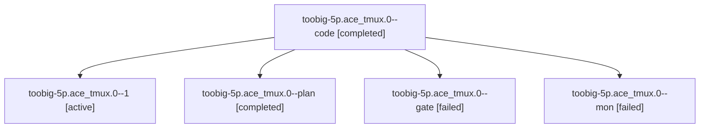

# Family: toobig-5p.ace\_tmux.0

[Agent Hoods](../README.md) / [bbugyi200](../users/bbugyi200/README.md) / [athena](../users/bbugyi200/machines/athena/README.md) / [toobig-5p](../users/bbugyi200/machines/athena/hoods/toobig-5p/README.md) / toobig-5p.ace\_tmux.0

Owner: `bbugyi200.athena` · Hood: `toobig-5p` · Members: 5

## Lineage

The diagram is an optional enhancement; the ordered table below contains the same lineage in accessible text.

| Role | Agent | State | Model / provider | Timing | Commits | Prompt | Chat |
|---|---|---|---|---|---:|---|---|
| code | toobig-5p.ace\_tmux.0--code | completed | gpt-5.6-terra / codex | 2026-09-19T18:25:59.813538+00:00 → 2026-09-19T18:31:30.740664+00:00 | 0 | — | [Chat](../agents/bbugyi200.athena.toobig-5p.ace_tmux.0--code/chat.md) |
| 1 | toobig-5p.ace\_tmux.0--1 | active | gpt-5.6-terra / codex | 2026-09-19T18:32:47.552758+00:00 | [1](../agents/bbugyi200.athena.toobig-5p.ace_tmux.0--1/README.md#commits) | [Prompt](../agents/bbugyi200.athena.toobig-5p.ace_tmux.0--1/prompt.md) | — |
| plan | toobig-5p.ace\_tmux.0--plan | completed | gpt-5.6-terra / codex | 2026-09-19T18:23:47.862033+00:00 → 2026-09-19T18:31:30.740664+00:00 | 0 | [Prompt](../agents/bbugyi200.athena.toobig-5p.ace_tmux.0--plan/prompt.md) | [Chat](../agents/bbugyi200.athena.toobig-5p.ace_tmux.0--plan/chat.md) |
| gate | toobig-5p.ace\_tmux.0--gate | failed | gpt-5.6-terra / codex | 2026-09-19T18:25:23.649302+00:00 → 2026-09-19T18:25:42.828698+00:00 | 0 | — | [Chat](../agents/bbugyi200.athena.toobig-5p.ace_tmux.0--gate/chat.md) |
| mon | toobig-5p.ace\_tmux.0--mon | failed | gpt-5.6-terra / codex | 2026-09-19T18:30:58.320427+00:00 → 2026-09-19T18:32:47.763032+00:00 | 0 | — | [Chat](../agents/bbugyi200.athena.toobig-5p.ace_tmux.0--mon/chat.md) |

## Commits

| Role | Repo | Commit | Subject | Committed |
|---|---|---|---|---|
| 1 | sase | [`e89aa25`](https://github.com/sase-org/sase/commit/e89aa2566af5293682e1f029366f989be55012f6) | refactor(ace): split tmux launcher modules | 2026-09-19 14:35:09 EDT |

## Neighbors

| Agent | Relation | State |
|---|---|---|
| [toobig-5p.agent\_runner\_slots.0](../agents/bbugyi200.athena.toobig-5p.agent_runner_slots.0/README.md) | toobig-5p hood | completed |
| [toobig-5p.commit\_dispatch.0](../agents/bbugyi200.athena.toobig-5p.commit_dispatch.0/README.md) | toobig-5p hood | completed |
| [toobig-5p.commit\_dispatch\_followup.0](bbugyi200.athena.toobig-5p.commit_dispatch_followup.0.md) (family · 3) | toobig-5p hood | completed 2, failed 1 |
| [toobig-5p.detach.0](../agents/bbugyi200.athena.toobig-5p.detach.0/README.md) | toobig-5p hood | waiting |
| [toobig-5p.execution.0](../agents/bbugyi200.athena.toobig-5p.execution.0/README.md) | toobig-5p hood | waiting |
| [toobig-5p.executor.0](../agents/bbugyi200.athena.toobig-5p.executor.0/README.md) | toobig-5p hood | waiting |
| [toobig-5p.host.0](../agents/bbugyi200.athena.toobig-5p.host.0/README.md) | toobig-5p hood | waiting |
| [toobig-5p.platform.0](../agents/bbugyi200.athena.toobig-5p.platform.0/README.md) | toobig-5p hood | waiting |
| [toobig-5p.runtime\_cache.0](../agents/bbugyi200.athena.toobig-5p.runtime_cache.0/README.md) | toobig-5p hood | completed |
| [toobig-5p.selector.0](../agents/bbugyi200.athena.toobig-5p.selector.0/README.md) | toobig-5p hood | waiting |
| [toobig-5p.ssh.0](../agents/bbugyi200.athena.toobig-5p.ssh.0/README.md) | toobig-5p hood | waiting |
| [toobig-5p.store\_clone\_ops.0](../agents/bbugyi200.athena.toobig-5p.store_clone_ops.0/README.md) | toobig-5p hood | waiting |
| [toobig-5p.test\_ace\_tmux.0](../agents/bbugyi200.athena.toobig-5p.test_ace_tmux.0/README.md) | toobig-5p hood | waiting |
| [toobig-5p.test\_agent\_hold\_service.0](../agents/bbugyi200.athena.toobig-5p.test_agent_hold_service.0/README.md) | toobig-5p hood | waiting |
| [toobig-5p.test\_agent\_loader\_query\_window.0](../agents/bbugyi200.athena.toobig-5p.test_agent_loader_query_window.0/README.md) | toobig-5p hood | waiting |
| [toobig-5p.test\_axe\_chop\_artifact\_link\_backfill.0](../agents/bbugyi200.athena.toobig-5p.test_axe_chop_artifact_link_backfill.0/README.md) | toobig-5p hood | waiting |
| [toobig-5p.test\_commit\_dispatch\_conflict\_repair\_followup.0](../agents/bbugyi200.athena.toobig-5p.test_commit_dispatch_conflict_repair_followup.0/README.md) | toobig-5p hood | waiting |
| [toobig-5p.test\_event\_handlers\_auto\_refresh\_dirty\_flags.0](../agents/bbugyi200.athena.toobig-5p.test_event_handlers_auto_refresh_dirty_flags.0/README.md) | toobig-5p hood | waiting |
| [toobig-5p.test\_finalizers\_protocol\_harness\_multi\_repo.0](../agents/bbugyi200.athena.toobig-5p.test_finalizers_protocol_harness_multi_repo.0/README.md) | toobig-5p hood | waiting |
| [toobig-5p.test\_fleet\_agents\_display\_parity.0](../agents/bbugyi200.athena.toobig-5p.test_fleet_agents_display_parity.0/README.md) | toobig-5p hood | waiting |
| [toobig-5p.test\_launch\_admission\_dispatch.0](../agents/bbugyi200.athena.toobig-5p.test_launch_admission_dispatch.0/README.md) | toobig-5p hood | waiting |
| [toobig-5p.test\_memory\_selector\_render.0](../agents/bbugyi200.athena.toobig-5p.test_memory_selector_render.0/README.md) | toobig-5p hood | waiting |
| [toobig-5p.test\_prompt\_history\_modal.0](../agents/bbugyi200.athena.toobig-5p.test_prompt_history_modal.0/README.md) | toobig-5p hood | waiting |
| [toobig-5p.test\_repo\_handler\_open\_configured.0](../agents/bbugyi200.athena.toobig-5p.test_repo_handler_open_configured.0/README.md) | toobig-5p hood | waiting |
| [toobig-5p.test\_run\_agent\_runner\_slot\_capacity.0](../agents/bbugyi200.athena.toobig-5p.test_run_agent_runner_slot_capacity.0/README.md) | toobig-5p hood | waiting |
| [toobig-5p.test\_run\_agent\_wait.0](../agents/bbugyi200.athena.toobig-5p.test_run_agent_wait.0/README.md) | toobig-5p hood | waiting |
| [toobig-5p.test\_sidecar\_clone\_retry.0](../agents/bbugyi200.athena.toobig-5p.test_sidecar_clone_retry.0/README.md) | toobig-5p hood | waiting |
| [toobig-5p.test\_sudo\_acceptance.0](../agents/bbugyi200.athena.toobig-5p.test_sudo_acceptance.0/README.md) | toobig-5p hood | waiting |
| [toobig-5p.test\_sudo\_gate.0](../agents/bbugyi200.athena.toobig-5p.test_sudo_gate.0/README.md) | toobig-5p hood | waiting |
| [toobig-5p.test\_v2\_io.0](../agents/bbugyi200.athena.toobig-5p.test_v2_io.0/README.md) | toobig-5p hood | waiting |
| [toobig-5p.test\_visual\_capture.0](../agents/bbugyi200.athena.toobig-5p.test_visual_capture.0/README.md) | toobig-5p hood | waiting |
| [toobig-5p.visual\_capture\_store.0](../agents/bbugyi200.athena.toobig-5p.visual_capture_store.0/README.md) | toobig-5p hood | waiting |
| [toobig-5p.visual\_maintenance\_run.0](../agents/bbugyi200.athena.toobig-5p.visual_maintenance_run.0/README.md) | toobig-5p hood | waiting |
