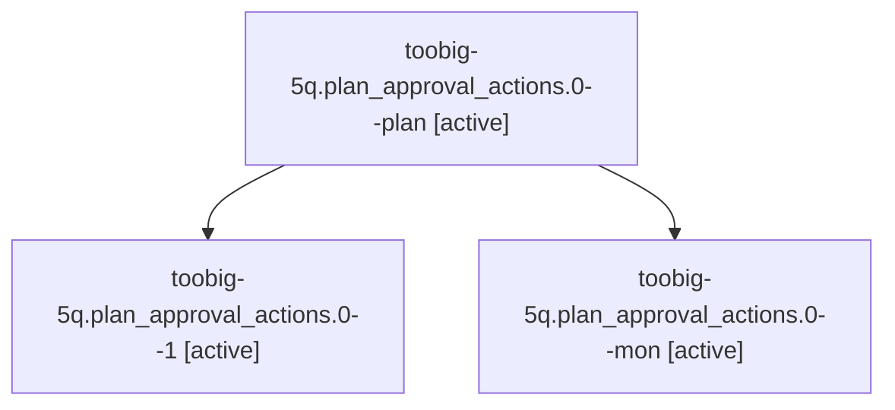

# Family: toobig-5q.plan\_approval\_actions.0

[Agent Hoods](../README.md) / [bbugyi200](../users/bbugyi200/README.md) / [athena](../users/bbugyi200/machines/athena/README.md) / [toobig-5q](../users/bbugyi200/machines/athena/hoods/toobig-5q/README.md) / toobig-5q.plan\_approval\_actions.0

Owner: `bbugyi200.athena` · Hood: `toobig-5q` · Members: 3

## Lineage

The diagram is an optional enhancement; the ordered table below contains the same lineage in accessible text.

| Role | Agent | State | Model / provider | Timing | Commits | Prompt | Chat |
|---|---|---|---|---|---:|---|---|
| plan | toobig-5q.plan\_approval\_actions.0--plan | active | muse-spark-1.3-contributor / muse | 2026-09-21T05:15:35.727481+00:00 | 0 | [Prompt](../agents/bbugyi200.athena.toobig-5q.plan_approval_actions.0--plan/prompt.md) | [Chat](../agents/bbugyi200.athena.toobig-5q.plan_approval_actions.0--plan/chat.md) |
| 1 | toobig-5q.plan\_approval\_actions.0--1 | active | muse-spark-1.3-contributor / muse | 2026-09-21T06:09:42.836205+00:00 | [1](../agents/bbugyi200.athena.toobig-5q.plan_approval_actions.0--1/README.md#commits) | [Prompt](../agents/bbugyi200.athena.toobig-5q.plan_approval_actions.0--1/prompt.md) | [Chat](../agents/bbugyi200.athena.toobig-5q.plan_approval_actions.0--1/chat.md) |
| mon | toobig-5q.plan\_approval\_actions.0--mon | active | muse-spark-1.3-contributor / muse | 2026-09-21T06:06:38.893081+00:00 | 0 | — | [Chat](../agents/bbugyi200.athena.toobig-5q.plan_approval_actions.0--mon/chat.md) |

## Commits

| Role | Repo | Commit | Subject | Committed |
|---|---|---|---|---|
| 1 | sase | [`eabd1bd`](https://github.com/sase-org/sase/commit/eabd1bd4b934f9bd784aa523c3768b46653a86b3) | refactor(plan-approval): split plan\_approval\_actions into facade plus response and side-effect modules | 2026-09-21 02:17:28 EDT |

## Neighbors

| Agent | Relation | State |
|---|---|---|
| [toobig-5q.detach.0](../agents/bbugyi200.athena.toobig-5q.detach.0/README.md) | toobig-5q hood | active |
| [toobig-5q.execution.0](../agents/bbugyi200.athena.toobig-5q.execution.0/README.md) | toobig-5q hood | active |
| [toobig-5q.executor.0](../agents/bbugyi200.athena.toobig-5q.executor.0/README.md) | toobig-5q hood | waiting |
| [toobig-5q.loading\_apply.0](../agents/bbugyi200.athena.toobig-5q.loading_apply.0/README.md) | toobig-5q hood | active |
| [toobig-5q.notification\_utils.0](../agents/bbugyi200.athena.toobig-5q.notification_utils.0/README.md) | toobig-5q hood | active |
| [toobig-5q.platform.0](../agents/bbugyi200.athena.toobig-5q.platform.0/README.md) | toobig-5q hood | active |
| [toobig-5q.ssh.0](../agents/bbugyi200.athena.toobig-5q.ssh.0/README.md) | toobig-5q hood | waiting |
| [toobig-5q.test\_ace\_tmux.0](../agents/bbugyi200.athena.toobig-5q.test_ace_tmux.0/README.md) | toobig-5q hood | waiting |
| [toobig-5q.test\_agent\_hold\_service.0](../agents/bbugyi200.athena.toobig-5q.test_agent_hold_service.0/README.md) | toobig-5q hood | active |
| [toobig-5q.test\_agent\_loader\_query\_window.0](../agents/bbugyi200.athena.toobig-5q.test_agent_loader_query_window.0/README.md) | toobig-5q hood | waiting |
| [toobig-5q.test\_agents\_tab\_apply\_boundary.0](../agents/bbugyi200.athena.toobig-5q.test_agents_tab_apply_boundary.0/README.md) | toobig-5q hood | waiting |
| [toobig-5q.test\_artifact\_link\_store\_reconcile.0](../agents/bbugyi200.athena.toobig-5q.test_artifact_link_store_reconcile.0/README.md) | toobig-5q hood | waiting |
| [toobig-5q.test\_axe\_chop\_artifact\_link\_backfill.0](../agents/bbugyi200.athena.toobig-5q.test_axe_chop_artifact_link_backfill.0/README.md) | toobig-5q hood | waiting |
| [toobig-5q.test\_commit\_dispatch\_conflict\_repair\_followup.0](../agents/bbugyi200.athena.toobig-5q.test_commit_dispatch_conflict_repair_followup.0/README.md) | toobig-5q hood | waiting |
| [toobig-5q.test\_event\_handlers\_auto\_refresh\_dirty\_flags.0](../agents/bbugyi200.athena.toobig-5q.test_event_handlers_auto_refresh_dirty_flags.0/README.md) | toobig-5q hood | waiting |
| [toobig-5q.test\_finalizers\_protocol\_harness\_multi\_repo.0](../agents/bbugyi200.athena.toobig-5q.test_finalizers_protocol_harness_multi_repo.0/README.md) | toobig-5q hood | waiting |
| [toobig-5q.test\_fleet\_agents\_display\_parity.0](../agents/bbugyi200.athena.toobig-5q.test_fleet_agents_display_parity.0/README.md) | toobig-5q hood | waiting |
| [toobig-5q.test\_init\_onboarding\_all.0](../agents/bbugyi200.athena.toobig-5q.test_init_onboarding_all.0/README.md) | toobig-5q hood | waiting |
| [toobig-5q.test\_launch\_admission\_dispatch.0](../agents/bbugyi200.athena.toobig-5q.test_launch_admission_dispatch.0/README.md) | toobig-5q hood | waiting |
| [toobig-5q.test\_memory\_selector\_render.0](../agents/bbugyi200.athena.toobig-5q.test_memory_selector_render.0/README.md) | toobig-5q hood | waiting |
| [toobig-5q.test\_notification\_toast\_polling\_agent\_refresh.0](../agents/bbugyi200.athena.toobig-5q.test_notification_toast_polling_agent_refresh.0/README.md) | toobig-5q hood | active |
| [toobig-5q.test\_prompt\_history\_modal.0](../agents/bbugyi200.athena.toobig-5q.test_prompt_history_modal.0/README.md) | toobig-5q hood | waiting |
| [toobig-5q.test\_repo\_handler\_open\_configured.0](../agents/bbugyi200.athena.toobig-5q.test_repo_handler_open_configured.0/README.md) | toobig-5q hood | waiting |
| [toobig-5q.test\_run\_agent\_runner\_slot\_capacity.0](../agents/bbugyi200.athena.toobig-5q.test_run_agent_runner_slot_capacity.0/README.md) | toobig-5q hood | waiting |
| [toobig-5q.test\_run\_agent\_wait.0](../agents/bbugyi200.athena.toobig-5q.test_run_agent_wait.0/README.md) | toobig-5q hood | active |
| [toobig-5q.test\_service\_platform.0](../agents/bbugyi200.athena.toobig-5q.test_service_platform.0/README.md) | toobig-5q hood | waiting |
| [toobig-5q.test\_sidecar\_clone\_retry.0](../agents/bbugyi200.athena.toobig-5q.test_sidecar_clone_retry.0/README.md) | toobig-5q hood | waiting |
| [toobig-5q.test\_sudo\_acceptance.0](../agents/bbugyi200.athena.toobig-5q.test_sudo_acceptance.0/README.md) | toobig-5q hood | waiting |
| [toobig-5q.test\_sudo\_gate.0](../agents/bbugyi200.athena.toobig-5q.test_sudo_gate.0/README.md) | toobig-5q hood | waiting |
| [toobig-5q.test\_v2\_io.0](../agents/bbugyi200.athena.toobig-5q.test_v2_io.0/README.md) | toobig-5q hood | waiting |
| [toobig-5q.test\_visual\_capture.0](../agents/bbugyi200.athena.toobig-5q.test_visual_capture.0/README.md) | toobig-5q hood | waiting |
| [toobig-5q.test\_workspace\_lease.0](../agents/bbugyi200.athena.toobig-5q.test_workspace_lease.0/README.md) | toobig-5q hood | waiting |
| [toobig-5q.visual\_capture\_store.0](../agents/bbugyi200.athena.toobig-5q.visual_capture_store.0/README.md) | toobig-5q hood | waiting |
| [toobig-5q.visual\_maintenance\_run.0](../agents/bbugyi200.athena.toobig-5q.visual_maintenance_run.0/README.md) | toobig-5q hood | active |
