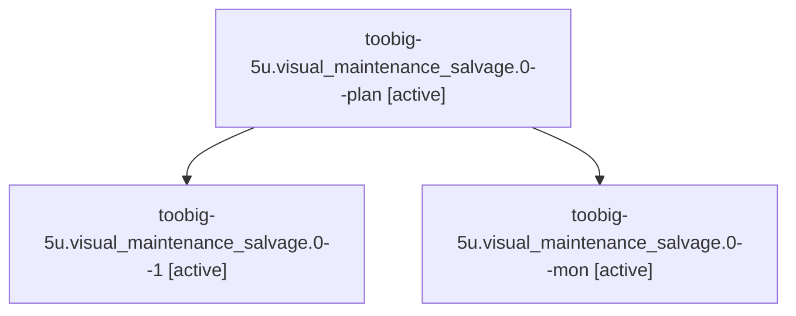

# Family: toobig-5u.visual\_maintenance\_salvage.0

[Agent Hoods](../README.md) / [bbugyi200](../users/bbugyi200/README.md) / [athena](../users/bbugyi200/machines/athena/README.md) / [toobig-5u](../users/bbugyi200/machines/athena/hoods/toobig-5u/README.md) / toobig-5u.visual\_maintenance\_salvage.0

Owner: `bbugyi200.athena` · Hood: `toobig-5u` · Members: 3

## Lineage

The diagram is an optional enhancement; the ordered table below contains the same lineage in accessible text.

| Role | Agent | State | Model / provider | Timing | Commits | Prompt | Chat |
|---|---|---|---|---|---:|---|---|
| plan | toobig-5u.visual\_maintenance\_salvage.0--plan | active | muse-spark-1.3-contributor / muse | 2026-09-22T17:28:55.510595+00:00 | 0 | [Prompt](../agents/bbugyi200.athena.toobig-5u.visual_maintenance_salvage.0--plan/prompt.md) | [Chat](../agents/bbugyi200.athena.toobig-5u.visual_maintenance_salvage.0--plan/chat.md) |
| 1 | toobig-5u.visual\_maintenance\_salvage.0--1 | active | muse-spark-1.3-contributor / muse | 2026-09-22T18:00:17.651300+00:00 | [1](../agents/bbugyi200.athena.toobig-5u.visual_maintenance_salvage.0--1/README.md#commits) | [Prompt](../agents/bbugyi200.athena.toobig-5u.visual_maintenance_salvage.0--1/prompt.md) | [Chat](../agents/bbugyi200.athena.toobig-5u.visual_maintenance_salvage.0--1/chat.md) |
| mon | toobig-5u.visual\_maintenance\_salvage.0--mon | active | muse-spark-1.3-contributor / muse | 2026-09-22T17:56:15.680689+00:00 | 0 | — | [Chat](../agents/bbugyi200.athena.toobig-5u.visual_maintenance_salvage.0--mon/chat.md) |

## Commits

| Role | Repo | Commit | Subject | Committed |
|---|---|---|---|---|
| 1 | sase | [`ea90a4d`](https://github.com/sase-org/sase/commit/ea90a4d5888d81ae9e8c99ad617631ec9d724233) | refactor(visual): split salvage maintenance module into recovery and finalize mixins | 2026-09-22 14:17:20 EDT |

## Neighbors

| Agent | Relation | State |
|---|---|---|
| [toobig-5u.test\_fix\_tui\_screenshots\_apply.0](../agents/bbugyi200.athena.toobig-5u.test_fix_tui_screenshots_apply.0/README.md) | toobig-5u hood | active |
| [toobig-5u.test\_render\_visual\_snapshot\_failure\_report.0](../agents/bbugyi200.athena.toobig-5u.test_render_visual_snapshot_failure_report.0/README.md) | toobig-5u hood | active |
