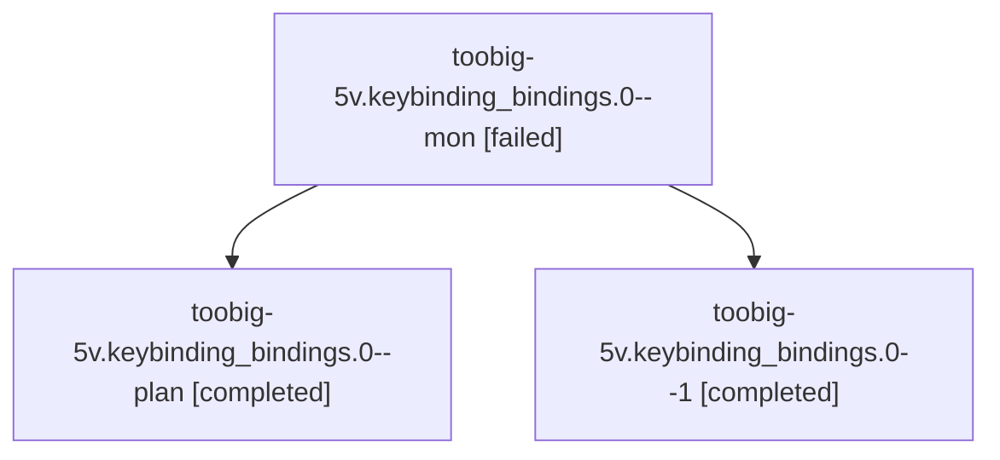

# Family: toobig-5v.keybinding\_bindings.0

[Agent Hoods](../README.md) / [bbugyi200](../users/bbugyi200/README.md) / [athena](../users/bbugyi200/machines/athena/README.md) / [toobig-5v](../users/bbugyi200/machines/athena/hoods/toobig-5v/README.md) / toobig-5v.keybinding\_bindings.0

Owner: `bbugyi200.athena` · Hood: `toobig-5v` · Members: 3

## Lineage

The diagram is an optional enhancement; the ordered table below contains the same lineage in accessible text.

| Role | Agent | State | Model / provider | Timing | Commits | Prompt | Chat |
|---|---|---|---|---|---:|---|---|
| mon | toobig-5v.keybinding\_bindings.0--mon | failed | muse-spark-1.3-contributor / muse | 2026-09-23T00:27:39.974338+00:00 → 2026-09-23T00:38:51.562074+00:00 | 0 | — | [Chat](../agents/bbugyi200.athena.toobig-5v.keybinding_bindings.0--mon/chat.md) |
| plan | toobig-5v.keybinding\_bindings.0--plan | completed | muse-spark-1.3-contributor / muse | 2026-09-22T23:49:36.075630+00:00 → 2026-09-23T00:28:00.410780+00:00 | 0 | [Prompt](../agents/bbugyi200.athena.toobig-5v.keybinding_bindings.0--plan/prompt.md) | [Chat](../agents/bbugyi200.athena.toobig-5v.keybinding_bindings.0--plan/chat.md) |
| 1 | toobig-5v.keybinding\_bindings.0--1 | completed | muse-spark-1.3-contributor / muse | 2026-09-23T00:39:02.483246+00:00 → 2026-09-23T00:47:09.959412+00:00 | [1](../agents/bbugyi200.athena.toobig-5v.keybinding_bindings.0--1/README.md#commits) | [Prompt](../agents/bbugyi200.athena.toobig-5v.keybinding_bindings.0--1/prompt.md) | [Chat](../agents/bbugyi200.athena.toobig-5v.keybinding_bindings.0--1/chat.md) |

## Commits

| Role | Repo | Commit | Subject | Committed |
|---|---|---|---|---|
| 1 | sase | [`ca6fa58`](https://github.com/sase-org/sase/commit/ca6fa5852225df8106e916e470b5be08af8688a6) | refactor(ace): split keybinding bindings mixin into facade plus four submodules | 2026-09-22 20:44:06 EDT |

## Neighbors

| Agent | Relation | State |
|---|---|---|
| [toobig-5v.agent\_enter\_targets.0](../agents/bbugyi200.athena.toobig-5v.agent_enter_targets.0/README.md) | toobig-5v hood | completed |
| [toobig-5v.display\_panel\_widgets.0](../agents/bbugyi200.athena.toobig-5v.display_panel_widgets.0/README.md) | toobig-5v hood | completed |
| [toobig-5v.host.0](../agents/bbugyi200.athena.toobig-5v.host.0/README.md) | toobig-5v hood | waiting |
| [toobig-5v.run\_agent\_runner\_setup.0](../agents/bbugyi200.athena.toobig-5v.run_agent_runner_setup.0/README.md) | toobig-5v hood | completed |
| [toobig-5v.runner\_workspace\_prepare.0](../agents/bbugyi200.athena.toobig-5v.runner_workspace_prepare.0/README.md) | toobig-5v hood | active |
| [toobig-5v.runner\_workspace\_sidecar.0](../agents/bbugyi200.athena.toobig-5v.runner_workspace_sidecar.0/README.md) | toobig-5v hood | waiting |
| [toobig-5v.test\_agent\_enter\_targets.0](../agents/bbugyi200.athena.toobig-5v.test_agent_enter_targets.0/README.md) | toobig-5v hood | waiting |
| [toobig-5v.test\_agent\_loader\_dedup\_merge.0](../agents/bbugyi200.athena.toobig-5v.test_agent_loader_dedup_merge.0/README.md) | toobig-5v hood | waiting |
| [toobig-5v.test\_service\_host\_scenarios.0](../agents/bbugyi200.athena.toobig-5v.test_service_host_scenarios.0/README.md) | toobig-5v hood | waiting |
| [toobig-5v.test\_workspace\_sidecar\_bead\_eviction.0](../agents/bbugyi200.athena.toobig-5v.test_workspace_sidecar_bead_eviction.0/README.md) | toobig-5v hood | waiting |
