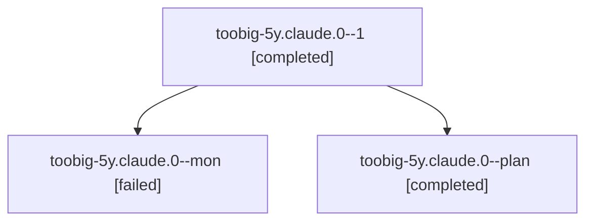

# Family: toobig-5y.claude.0

[Agent Hoods](../README.md) / [bbugyi200](../users/bbugyi200/README.md) / [athena](../users/bbugyi200/machines/athena/README.md) / [toobig-5y](../users/bbugyi200/machines/athena/hoods/toobig-5y/README.md) / toobig-5y.claude.0

Owner: `bbugyi200.athena` · Hood: `toobig-5y` · Members: 3

## Lineage

The diagram is an optional enhancement; the ordered table below contains the same lineage in accessible text.

| Role | Agent | State | Model / provider | Timing | Commits | Prompt | Chat |
|---|---|---|---|---|---:|---|---|
| 1 | toobig-5y.claude.0--1 | completed | muse-spark-1.3-contributor / muse | 2026-09-23T23:52:18.805734+00:00 → 2026-09-23T23:57:46.498919+00:00 | [1](../agents/bbugyi200.athena.toobig-5y.claude.0--1/README.md#commits) | [Prompt](../agents/bbugyi200.athena.toobig-5y.claude.0--1/prompt.md) | [Chat](../agents/bbugyi200.athena.toobig-5y.claude.0--1/chat.md) |
| mon | toobig-5y.claude.0--mon | failed | muse-spark-1.3-contributor / muse | 2026-09-23T23:47:40.220291+00:00 → 2026-09-23T23:52:18.413213+00:00 | 0 | — | [Chat](../agents/bbugyi200.athena.toobig-5y.claude.0--mon/chat.md) |
| plan | toobig-5y.claude.0--plan | completed | muse-spark-1.3-contributor / muse | 2026-09-23T23:40:23.503963+00:00 → 2026-09-23T23:47:59.961943+00:00 | 0 | [Prompt](../agents/bbugyi200.athena.toobig-5y.claude.0--plan/prompt.md) | [Chat](../agents/bbugyi200.athena.toobig-5y.claude.0--plan/chat.md) |

## Commits

| Role | Repo | Commit | Subject | Committed |
|---|---|---|---|---|
| 1 | sase | [`933a170`](https://github.com/sase-org/sase/commit/933a170f3ccec2c203eb640331c820ade92a9950) | refactor(usage): split claude.py collector into focused modules under 500 lines | 2026-09-23 19:55:03 EDT |

## Neighbors

| Agent | Relation | State |
|---|---|---|
| [toobig-5y.beads\_navigation.0](../agents/bbugyi200.athena.toobig-5y.beads_navigation.0/README.md) | toobig-5y hood | completed |
| [toobig-5y.panes.0](../agents/bbugyi200.athena.toobig-5y.panes.0/README.md) | toobig-5y hood | completed |
| [toobig-5y.plugins\_browser\_install.0](../agents/bbugyi200.athena.toobig-5y.plugins_browser_install.0/README.md) | toobig-5y hood | completed |
| [toobig-5y.presentation.0](../agents/bbugyi200.athena.toobig-5y.presentation.0/README.md) | toobig-5y hood | completed |
| [toobig-5y.refresh.0](../agents/bbugyi200.athena.toobig-5y.refresh.0/README.md) | toobig-5y hood | completed |
| [toobig-5y.startup\_loads.0](../agents/bbugyi200.athena.toobig-5y.startup_loads.0/README.md) | toobig-5y hood | completed |
| [toobig-5y.test\_ace\_png\_snapshots\_prompt\_highlighting.0](../agents/bbugyi200.athena.toobig-5y.test_ace_png_snapshots_prompt_highlighting.0/README.md) | toobig-5y hood | active |
| [toobig-5y.test\_agent\_jump\_panel.0](../agents/bbugyi200.athena.toobig-5y.test_agent_jump_panel.0/README.md) | toobig-5y hood | waiting |
| [toobig-5y.test\_agent\_tribe\_assignment.0](../agents/bbugyi200.athena.toobig-5y.test_agent_tribe_assignment.0/README.md) | toobig-5y hood | completed |
| [toobig-5y.test\_install.0](../agents/bbugyi200.athena.toobig-5y.test_install.0/README.md) | toobig-5y hood | waiting |
| [toobig-5y.test\_keymaps\_defaults.0](../agents/bbugyi200.athena.toobig-5y.test_keymaps_defaults.0/README.md) | toobig-5y hood | waiting |
| [toobig-5y.test\_plugins\_browser\_rows.0](../agents/bbugyi200.athena.toobig-5y.test_plugins_browser_rows.0/README.md) | toobig-5y hood | completed |
| [toobig-5y.test\_xprompt\_vcs\_project\_completion.0](../agents/bbugyi200.athena.toobig-5y.test_xprompt_vcs_project_completion.0/README.md) | toobig-5y hood | waiting |
