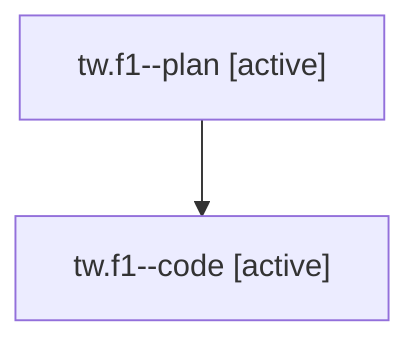

# Family: tw.f1

[Agent Hoods](../README.md) / [bbugyi200](../users/bbugyi200/README.md) / [athena](../users/bbugyi200/machines/athena/README.md) / [tw](../users/bbugyi200/machines/athena/hoods/tw/README.md) / tw.f1

Owner: `bbugyi200.athena` · Hood: `tw` · Members: 2

## Lineage

The diagram is an optional enhancement; the ordered table below contains the same lineage in accessible text.

| Role | Agent | State | Model / provider | Timing | Commits | Prompt | Chat |
|---|---|---|---|---|---:|---|---|
| plan | tw.f1--plan | active | opus / claude | 2026-08-06T13:30:05.090287+00:00 | 0 | [Prompt](../agents/bbugyi200.athena.tw.f1--plan/prompt.md) | [Chat](../agents/bbugyi200.athena.tw.f1--plan/chat.md) |
| code | tw.f1--code | active | sonnet / claude | 2026-08-06T13:42:24.825864+00:00 | 0 | — | — |

## Neighbors

| Agent | Relation | State |
|---|---|---|
| [tw](bbugyi200.athena.tw.md) (family · 2) | ancestor | completed 2 |
| [tw.f0](../agents/bbugyi200.athena.tw.f0/README.md) | tw hood | dismissed |
