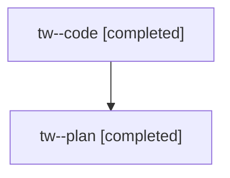

# Family: tw

[Agent Hoods](../README.md) / [bbugyi200](../users/bbugyi200/README.md) / [athena](../users/bbugyi200/machines/athena/README.md) / [tw](../users/bbugyi200/machines/athena/hoods/tw/README.md) / tw

Owner: `bbugyi200.athena` · Hood: `tw` · Members: 2

## Lineage

The diagram is an optional enhancement; the ordered table below contains the same lineage in accessible text.

| Role | Agent | State | Model / provider | Timing | Commits | Prompt | Chat |
|---|---|---|---|---|---:|---|---|
| code | tw--code | completed | sonnet / claude | 2026-08-06T12:46:40.802257+00:00 | [1](../agents/bbugyi200.athena.tw--code/README.md#commits) | — | [Chat](../agents/bbugyi200.athena.tw--code/chat.md) |
| plan | tw--plan | completed | opus / claude | 2026-08-06T12:29:49.026351+00:00 | 0 | [Prompt](../agents/bbugyi200.athena.tw--plan/prompt.md) | [Chat](../agents/bbugyi200.athena.tw--plan/chat.md) |

## Commits

| Role | Repo | Commit | Subject | Committed |
|---|---|---|---|---|
| code | sase | [`e0acf80`](https://github.com/sase-org/sase/commit/e0acf8097775a472cb8d47e2d4b25a8cbd6aadc1) | fix(tests): stop a contract test from leaking TMPDIR across its xdist worker | 2026-08-06 09:09:08 EDT |

## Neighbors

| Agent | Relation | State |
|---|---|---|
| [tw.f0](../agents/bbugyi200.athena.tw.f0/README.md) | descendant | dismissed |
| [tw.f1](bbugyi200.athena.tw.f1.md) (family · 2) | descendant | active 2 |
