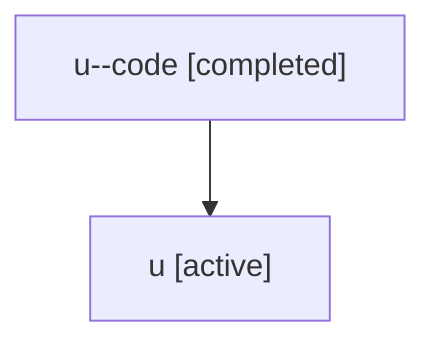

# Family: u

Owner: `bbugyi200.athena` · Hood: `u` · Members: 2

## Lineage

The diagram is an optional enhancement; the ordered table below contains the same lineage in accessible text.

| Role | Agent | State | Model / provider | Timing | Commits | Prompt | Chat |
|---|---|---|---|---|---:|---|---|
| code | u--code | completed | gpt-5.5 / codex | 2026-07-06T23:33:23.762236+00:00 | 0 | — | [Chat](../agents/bbugyi200.athena.u--code/chat.md) |
| root | u | active | claude-fable-5 / claude | 2026-07-06T23:23:05.704230+00:00 | 4 | [Prompt](../agents/bbugyi200.athena.u/prompt.md) | [Chat](../agents/bbugyi200.athena.u/chat.md) |
