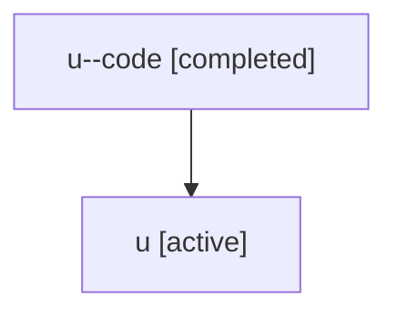

# Family: u

[Agent Hoods](../README.md) / [bbugyi200](../users/bbugyi200/README.md) / [athena](../users/bbugyi200/machines/athena/README.md) / [u](../users/bbugyi200/machines/athena/hoods/u/README.md) / u

Owner: `bbugyi200.athena` · Hood: `u` · Members: 2

## Lineage

The diagram is an optional enhancement; the ordered table below contains the same lineage in accessible text.

| Role | Agent | State | Model / provider | Timing | Commits | Prompt | Chat |
|---|---|---|---|---|---:|---|---|
| code | u--code | completed | gpt-5.5 / codex | 2026-07-06T23:33:23.762236+00:00 | 0 | — | [Chat](../agents/bbugyi200.athena.u--code/chat.md) |
| root | u | active | claude-fable-5 / claude | 2026-07-06T23:23:05.704230+00:00 | [4](../agents/bbugyi200.athena.u/README.md#commits) | [Prompt](../agents/bbugyi200.athena.u/prompt.md) | [Chat](../agents/bbugyi200.athena.u/chat.md) |

## Commits

| Role | Repo | Commit | Subject | Committed (UTC) |
|---|---|---|---|---|
| root | sase | [`3be27db`](https://github.com/sase-org/sase/commit/3be27dbe78067f86eabc715f64653c5adb4e3f1a) | chore: Add SDD prompt and plan for slow\_tool\_calls\_metadata\_panel | 2026-07-03 16:19:30 |
| root | sase | [`4536419`](https://github.com/sase-org/sase/commit/4536419035284fb5064c9a09a964986362f6a8f0) | feat(tui): surface slow tool calls in agent metadata | 2026-07-03 17:03:03 |
| root | sase | [`3fe09a7`](https://github.com/sase-org/sase/commit/3fe09a76c40be608c99ae193f6496372a2d11ac8) | chore: Add SDD prompt and plan for tab\_onboarding\_quickstart | 2026-07-06 23:33:22 |
| root | sase | [`6fdd502`](https://github.com/sase-org/sase/commit/6fdd502c5a50387c54741830eb88893ec86acc28) | feat(tui): add tab quickstart onboarding | 2026-07-06 23:54:27 |
