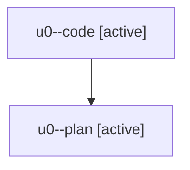

# Family: u0

[Agent Hoods](../README.md) / [bbugyi200](../users/bbugyi200/README.md) / [athena](../users/bbugyi200/machines/athena/README.md) / [u0](../users/bbugyi200/machines/athena/hoods/u0/README.md) / u0

Owner: `bbugyi200.athena` · Hood: `u0` · Members: 2

## Lineage

The diagram is an optional enhancement; the ordered table below contains the same lineage in accessible text.

| Role | Agent | State | Model / provider | Timing | Commits | Prompt | Chat |
|---|---|---|---|---|---:|---|---|
| code | u0--code | active | sonnet / claude | 2026-08-06T13:30:29.413164+00:00 | [1](../agents/bbugyi200.athena.u0--code/README.md#commits) | — | — |
| plan | u0--plan | active | opus / claude | 2026-08-06T13:15:27.909642+00:00 | 0 | [Prompt](../agents/bbugyi200.athena.u0--plan/prompt.md) | [Chat](../agents/bbugyi200.athena.u0--plan/chat.md) |

## Commits

| Role | Repo | Commit | Subject | Committed |
|---|---|---|---|---|
| code | sase | [`48a34b4`](https://github.com/sase-org/sase/commit/48a34b4a11b9dd3553a3e0bd0fa4545ccddb10f6) | feat(agents-sync): link published agent pages back to their bead pages | 2026-08-06 09:58:44 EDT |
