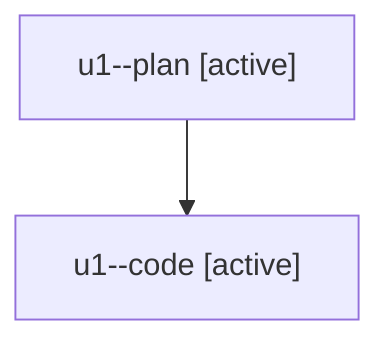

# Family: u1

[Agent Hoods](../README.md) / [bbugyi200](../users/bbugyi200/README.md) / [athena](../users/bbugyi200/machines/athena/README.md) / [u1](../users/bbugyi200/machines/athena/hoods/u1/README.md) / u1

Owner: `bbugyi200.athena` · Hood: `u1` · Members: 2

## Lineage

The diagram is an optional enhancement; the ordered table below contains the same lineage in accessible text.

| Role | Agent | State | Model / provider | Timing | Commits | Prompt | Chat |
|---|---|---|---|---|---:|---|---|
| plan | u1--plan | active | opus / claude | 2026-08-06T13:26:44.854222+00:00 | 0 | [Prompt](../agents/bbugyi200.athena.u1--plan/prompt.md) | [Chat](../agents/bbugyi200.athena.u1--plan/chat.md) |
| code | u1--code | active | sonnet / claude | 2026-08-06T13:45:38.021857+00:00 | 0 | — | — |
