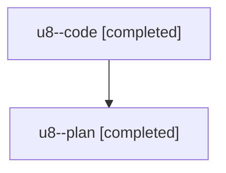

# Family: u8

[Agent Hoods](../README.md) / [bbugyi200](../users/bbugyi200/README.md) / [athena](../users/bbugyi200/machines/athena/README.md) / [u8](../users/bbugyi200/machines/athena/hoods/u8/README.md) / u8

Owner: `bbugyi200.athena` · Hood: `u8` · Members: 2

## Lineage

The diagram is an optional enhancement; the ordered table below contains the same lineage in accessible text.

| Role | Agent | State | Model / provider | Timing | Commits | Prompt | Chat |
|---|---|---|---|---|---:|---|---|
| code | u8--code | completed | sonnet / claude | 2026-08-06T17:08:15.276425+00:00 | [1](../agents/bbugyi200.athena.u8--code/README.md#commits) | — | [Chat](../agents/bbugyi200.athena.u8--code/chat.md) |
| plan | u8--plan | completed | opus / claude | 2026-08-06T16:50:22.130563+00:00 | 0 | [Prompt](../agents/bbugyi200.athena.u8--plan/prompt.md) | [Chat](../agents/bbugyi200.athena.u8--plan/chat.md) |

## Commits

| Role | Repo | Commit | Subject | Committed |
|---|---|---|---|---|
| code | sase | [`baebfcd`](https://github.com/sase-org/sase/commit/baebfcd216319315e169d4c189666fe3db148048) | fix(sdd-store): degrade unresolvable agents sidecar instead of aborting store resolution | 2026-08-06 13:22:44 EDT |
