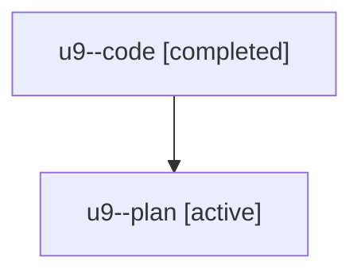

# Family: u9

[Agent Hoods](../README.md) / [bbugyi200](../users/bbugyi200/README.md) / [athena](../users/bbugyi200/machines/athena/README.md) / [u9](../users/bbugyi200/machines/athena/hoods/u9/README.md) / u9

Owner: `bbugyi200.athena` · Hood: `u9` · Members: 2

## Lineage

The diagram is an optional enhancement; the ordered table below contains the same lineage in accessible text.

| Role | Agent | State | Model / provider | Timing | Commits | Prompt | Chat |
|---|---|---|---|---|---:|---|---|
| code | u9--code | completed | sonnet / claude | 2026-08-06T17:28:35.789373+00:00 | [1](../agents/bbugyi200.athena.u9--code/README.md#commits) | — | [Chat](../agents/bbugyi200.athena.u9--code/chat.md) |
| plan | u9--plan | active | opus / claude | 2026-08-06T17:13:26.795680+00:00 | 0 | [Prompt](../agents/bbugyi200.athena.u9--plan/prompt.md) | [Chat](../agents/bbugyi200.athena.u9--plan/chat.md) |

## Commits

| Role | Repo | Commit | Subject | Committed |
|---|---|---|---|---|
| code | sase | [`8fcc252`](https://github.com/sase-org/sase/commit/8fcc2520fb17e20ba0d8c17381bbde58e8145949) | feat(ace-tui): show FAMILY MEMBERS roster on family-member detail panels | 2026-08-06 18:03:29 UTC |
