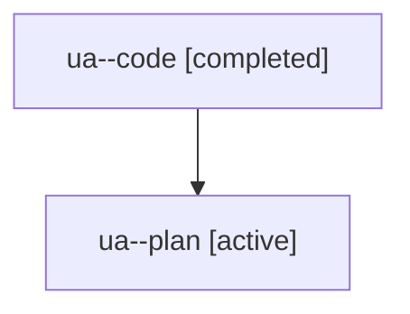

# Family: ua

[Agent Hoods](../README.md) / [bbugyi200](../users/bbugyi200/README.md) / [athena](../users/bbugyi200/machines/athena/README.md) / [ua](../users/bbugyi200/machines/athena/hoods/ua/README.md) / ua

Owner: `bbugyi200.athena` · Hood: `ua` · Members: 2

## Lineage

The diagram is an optional enhancement; the ordered table below contains the same lineage in accessible text.

| Role | Agent | State | Model / provider | Timing | Commits | Prompt | Chat |
|---|---|---|---|---|---:|---|---|
| code | ua--code | completed | sonnet / claude | 2026-08-06T19:13:10.283635+00:00 | [1](../agents/bbugyi200.athena.ua--code/README.md#commits) | — | [Chat](../agents/bbugyi200.athena.ua--code/chat.md) |
| plan | ua--plan | active | opus / claude | 2026-08-06T19:05:30.592666+00:00 | 0 | [Prompt](../agents/bbugyi200.athena.ua--plan/prompt.md) | [Chat](../agents/bbugyi200.athena.ua--plan/chat.md) |

## Commits

| Role | Repo | Commit | Subject | Committed |
|---|---|---|---|---|
| code | sase | [`5da1934`](https://github.com/sase-org/sase/commit/5da193482e4f755413418330e7f5c3e681ccf73f) | fix(llm): wrap agent prompts at the repo-wide 120-column width | 2026-08-06 15:36:09 EDT |
