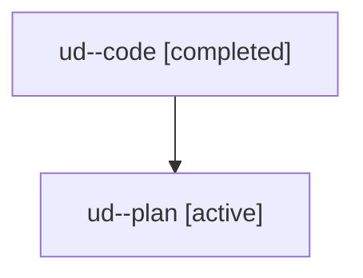

# Family: ud

[Agent Hoods](../README.md) / [bbugyi200](../users/bbugyi200/README.md) / [athena](../users/bbugyi200/machines/athena/README.md) / [ud](../users/bbugyi200/machines/athena/hoods/ud/README.md) / ud

Owner: `bbugyi200.athena` · Hood: `ud` · Members: 2

## Lineage

The diagram is an optional enhancement; the ordered table below contains the same lineage in accessible text.

| Role | Agent | State | Model / provider | Timing | Commits | Prompt | Chat |
|---|---|---|---|---|---:|---|---|
| code | ud--code | completed | sonnet / claude | 2026-08-06T19:48:44.625276+00:00 | [1](../agents/bbugyi200.athena.ud--code/README.md#commits) | — | [Chat](../agents/bbugyi200.athena.ud--code/chat.md) |
| plan | ud--plan | active | opus / claude | 2026-08-06T19:36:51.001649+00:00 | 0 | [Prompt](../agents/bbugyi200.athena.ud--plan/prompt.md) | [Chat](../agents/bbugyi200.athena.ud--plan/chat.md) |

## Commits

| Role | Repo | Commit | Subject | Committed |
|---|---|---|---|---|
| code | sase | [`2c11c4e`](https://github.com/sase-org/sase/commit/2c11c4eb85e3c421e76897c871b47c5425cb663a) | feat(cli): add \`sase plan show\` detail command | 2026-08-06 20:41:47 UTC |
