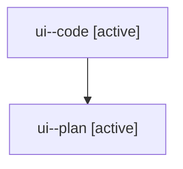

# Family: ui

[Agent Hoods](../README.md) / [bbugyi200](../users/bbugyi200/README.md) / [athena](../users/bbugyi200/machines/athena/README.md) / [ui](../users/bbugyi200/machines/athena/hoods/ui/README.md) / ui

Owner: `bbugyi200.athena` · Hood: `ui` · Members: 2

## Lineage

The diagram is an optional enhancement; the ordered table below contains the same lineage in accessible text.

| Role | Agent | State | Model / provider | Timing | Commits | Prompt | Chat |
|---|---|---|---|---|---:|---|---|
| code | ui--code | active | sonnet / claude | 2026-08-07T12:39:48.292769+00:00 | 0 | — | — |
| plan | ui--plan | active | opus / claude | 2026-08-07T12:26:43.817727+00:00 | 0 | [Prompt](../agents/bbugyi200.athena.ui--plan/prompt.md) | [Chat](../agents/bbugyi200.athena.ui--plan/chat.md) |
