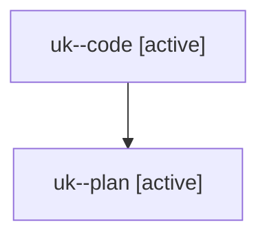

# Family: uk

[Agent Hoods](../README.md) / [bbugyi200](../users/bbugyi200/README.md) / [athena](../users/bbugyi200/machines/athena/README.md) / [uk](../users/bbugyi200/machines/athena/hoods/uk/README.md) / uk

Owner: `bbugyi200.athena` · Hood: `uk` · Members: 2

## Lineage

The diagram is an optional enhancement; the ordered table below contains the same lineage in accessible text.

| Role | Agent | State | Model / provider | Timing | Commits | Prompt | Chat |
|---|---|---|---|---|---:|---|---|
| code | uk--code | active | sonnet / claude | 2026-08-07T13:03:01.081522+00:00 | 0 | — | — |
| plan | uk--plan | active | opus / claude | 2026-08-07T12:52:17.838051+00:00 | 0 | [Prompt](../agents/bbugyi200.athena.uk--plan/prompt.md) | [Chat](../agents/bbugyi200.athena.uk--plan/chat.md) |
