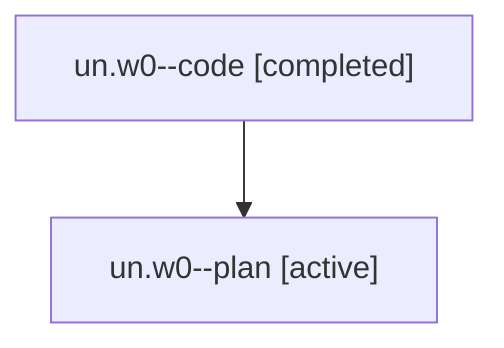

# Family: un.w0

[Agent Hoods](../README.md) / [bbugyi200](../users/bbugyi200/README.md) / [athena](../users/bbugyi200/machines/athena/README.md) / [un](../users/bbugyi200/machines/athena/hoods/un/README.md) / un.w0

Owner: `bbugyi200.athena` · Hood: `un` · Members: 2

## Lineage

The diagram is an optional enhancement; the ordered table below contains the same lineage in accessible text.

| Role | Agent | State | Model / provider | Timing | Commits | Prompt | Chat |
|---|---|---|---|---|---:|---|---|
| code | un.w0--code | completed | sonnet / claude | 2026-08-07T14:40:11.472097+00:00 | [1](../agents/bbugyi200.athena.un.w0--code/README.md#commits) | — | [Chat](../agents/bbugyi200.athena.un.w0--code/chat.md) |
| plan | un.w0--plan | active | opus / claude | 2026-08-07T14:28:26.574522+00:00 | 0 | [Prompt](../agents/bbugyi200.athena.un.w0--plan/prompt.md) | [Chat](../agents/bbugyi200.athena.un.w0--plan/chat.md) |

## Commits

| Role | Repo | Commit | Subject | Committed |
|---|---|---|---|---|
| code | sase | [`8865cf5`](https://github.com/sase-org/sase/commit/8865cf54da8a014299f8771a2d92335b80b6c33b) | test(bead): pin the snooze note contract across CLI, gate, and lifecycle | 2026-08-07 11:08:15 EDT |

## Neighbors

| Agent | Relation | State |
|---|---|---|
| [un](bbugyi200.athena.un.md) (family · 2) | ancestor | active 1, completed 1 |
