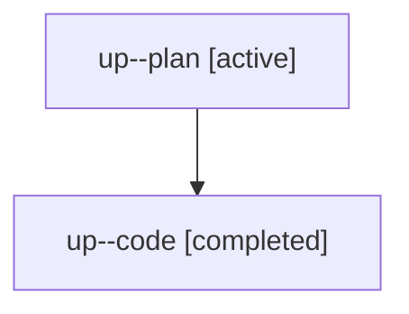

# Family: up

[Agent Hoods](../README.md) / [bbugyi200](../users/bbugyi200/README.md) / [athena](../users/bbugyi200/machines/athena/README.md) / [up](../users/bbugyi200/machines/athena/hoods/up/README.md) / up

Owner: `bbugyi200.athena` · Hood: `up` · Members: 2

## Lineage

The diagram is an optional enhancement; the ordered table below contains the same lineage in accessible text.

| Role | Agent | State | Model / provider | Timing | Commits | Prompt | Chat |
|---|---|---|---|---|---:|---|---|
| plan | up--plan | active | opus / claude | 2026-08-07T13:38:30.407912+00:00 | 0 | [Prompt](../agents/bbugyi200.athena.up--plan/prompt.md) | [Chat](../agents/bbugyi200.athena.up--plan/chat.md) |
| code | up--code | completed | sonnet / claude | 2026-08-07T13:51:51.520593+00:00 | [1](../agents/bbugyi200.athena.up--code/README.md#commits) | — | [Chat](../agents/bbugyi200.athena.up--code/chat.md) |

## Commits

| Role | Repo | Commit | Subject | Committed |
|---|---|---|---|---|
| code | sase | [`6399389`](https://github.com/sase-org/sase/commit/6399389e5994a9fef98dceb34f0452b350f36c5c) | feat(ace): show a cursor line/column readout for every prompt input pane | 2026-08-07 15:17:19 UTC |
