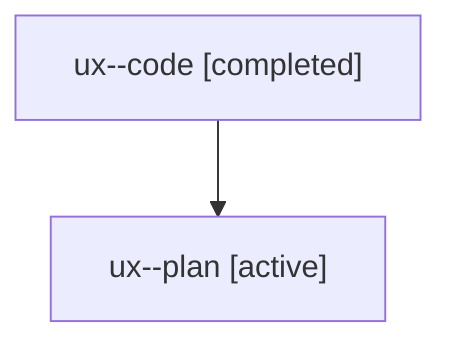

# Family: ux

[Agent Hoods](../README.md) / [bbugyi200](../users/bbugyi200/README.md) / [athena](../users/bbugyi200/machines/athena/README.md) / [ux](../users/bbugyi200/machines/athena/hoods/ux/README.md) / ux

Owner: `bbugyi200.athena` · Hood: `ux` · Members: 2

## Lineage

The diagram is an optional enhancement; the ordered table below contains the same lineage in accessible text.

| Role | Agent | State | Model / provider | Timing | Commits | Prompt | Chat |
|---|---|---|---|---|---:|---|---|
| code | ux--code | completed | sonnet / claude | 2026-08-07T18:28:29.579955+00:00 | [1](../agents/bbugyi200.athena.ux--code/README.md#commits) | — | [Chat](../agents/bbugyi200.athena.ux--code/chat.md) |
| plan | ux--plan | active | opus / claude | 2026-08-07T18:15:14.274298+00:00 | 0 | [Prompt](../agents/bbugyi200.athena.ux--plan/prompt.md) | [Chat](../agents/bbugyi200.athena.ux--plan/chat.md) |

## Commits

| Role | Repo | Commit | Subject | Committed |
|---|---|---|---|---|
| code | sase | [`28e8ed1`](https://github.com/sase-org/sase/commit/28e8ed1cebc384f1a283cf7b010c27d981b7f49d) | fix(ace): materialize byte-free artifact rows before opening from Agents tab | 2026-08-07 14:52:30 EDT |
