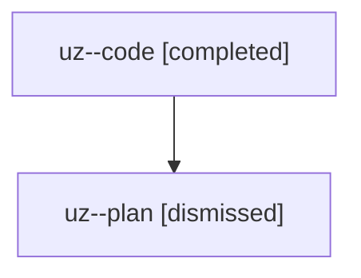

# Family: uz

[Agent Hoods](../README.md) / [bbugyi200](../users/bbugyi200/README.md) / [athena](../users/bbugyi200/machines/athena/README.md) / [uz](../users/bbugyi200/machines/athena/hoods/uz/README.md) / uz

Owner: `bbugyi200.athena` · Hood: `uz` · Members: 2

## Lineage

The diagram is an optional enhancement; the ordered table below contains the same lineage in accessible text.

| Role | Agent | State | Model / provider | Timing | Commits | Prompt | Chat |
|---|---|---|---|---|---:|---|---|
| code | uz--code | completed | sonnet / claude | 2026-08-07T18:55:33.102989+00:00 | [1](../agents/bbugyi200.athena.uz--code/README.md#commits) | — | [Chat](../agents/bbugyi200.athena.uz--code/chat.md) |
| plan | uz--plan | dismissed | opus / claude | 2026-08-07T14:43:07.395005 → 2026-08-07T15:21:43.200308 | 0 | — | [Chat](../agents/bbugyi200.athena.uz--plan/chat.md) |

## Commits

| Role | Repo | Commit | Subject | Committed |
|---|---|---|---|---|
| code | sase | [`41103b5`](https://github.com/sase-org/sase/commit/41103b594bd852f35e798961a5a7706f4f498246) | fix(ace): route ChangeSpec navigation through the Artifacts PRs sub-tab | 2026-08-07 19:21:12 UTC |
