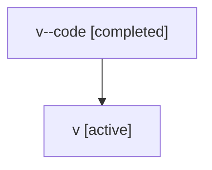

# Family: v

Owner: `bbugyi200.athena` · Hood: `v` · Members: 2

## Lineage

The diagram is an optional enhancement; the ordered table below contains the same lineage in accessible text.

| Role | Agent | State | Model / provider | Timing | Commits | Prompt | Chat |
|---|---|---|---|---|---:|---|---|
| code | v--code | completed | gpt-5.5 / codex | 2026-07-06T23:31:50.771380+00:00 | 0 | — | [Chat](../agents/bbugyi200.athena.v--code/chat.md) |
| root | v | active | gpt-5.5 / codex | 2026-07-06T23:30:02.286136+00:00 | 3 | [Prompt](../agents/bbugyi200.athena.v/prompt.md) | [Chat](../agents/bbugyi200.athena.v/chat.md) |
