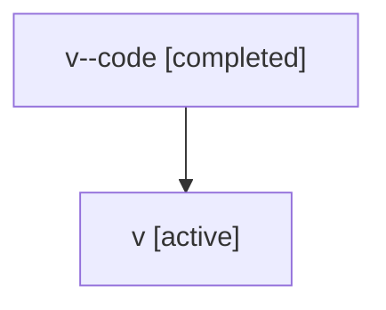

# Family: v

[Agent Hoods](../README.md) / [bbugyi200](../users/bbugyi200/README.md) / [athena](../users/bbugyi200/machines/athena/README.md) / [v](../users/bbugyi200/machines/athena/hoods/v/README.md) / v

Owner: `bbugyi200.athena` · Hood: `v` · Members: 2

## Lineage

The diagram is an optional enhancement; the ordered table below contains the same lineage in accessible text.

| Role | Agent | State | Model / provider | Timing | Commits | Prompt | Chat |
|---|---|---|---|---|---:|---|---|
| code | v--code | completed | gpt-5.5 / codex | 2026-07-06T23:31:50.771380+00:00 | [1](../agents/bbugyi200.athena.v--code/README.md#commits) | — | [Chat](../agents/bbugyi200.athena.v--code/chat.md) |
| root | v | active | gpt-5.5 / codex | 2026-07-06T23:30:02.286136+00:00 | [1](../agents/bbugyi200.athena.v/README.md#commits) | [Prompt](../agents/bbugyi200.athena.v/prompt.md) | [Chat](../agents/bbugyi200.athena.v/chat.md) |

## Commits

| Role | Repo | Commit | Subject | Committed |
|---|---|---|---|---|
| — | sase | [`d2ac8c3`](https://github.com/sase-org/sase/commit/d2ac8c317cf07e2691e958b972761f2f1e31d5c6) | chore: Add SDD prompt and plan for telegram\_enabled\_gate | 2026-07-03 18:03:03 UTC |
| root | sase | [`f48e881`](https://github.com/sase-org/sase/commit/f48e8818e340a6404b9d8c7c2f381b1072c67c4f) | chore: Add SDD prompt and plan for nested\_agent\_docs\_provider\_shims | 2026-07-06 23:31:49 UTC |
| code | sase | [`17acd9f`](https://github.com/sase-org/sase/commit/17acd9fec688aa5995fc9f636dc4e9ab2b43a278) | fix: manage nested agent doc provider shims | 2026-07-06 23:41:47 UTC |
