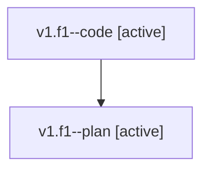

# Family: v1.f1

[Agent Hoods](../README.md) / [bbugyi200](../users/bbugyi200/README.md) / [athena](../users/bbugyi200/machines/athena/README.md) / [v1](../users/bbugyi200/machines/athena/hoods/v1/README.md) / v1.f1

Owner: `bbugyi200.athena` · Hood: `v1` · Members: 2

## Lineage

The diagram is an optional enhancement; the ordered table below contains the same lineage in accessible text.

| Role | Agent | State | Model / provider | Timing | Commits | Prompt | Chat |
|---|---|---|---|---|---:|---|---|
| code | v1.f1--code | active | sonnet / claude | 2026-08-07T21:38:34.780054+00:00 | [1](../agents/bbugyi200.athena.v1.f1--code/README.md#commits) | — | — |
| plan | v1.f1--plan | active | opus / claude | 2026-08-07T21:27:20.494494+00:00 | 0 | [Prompt](../agents/bbugyi200.athena.v1.f1--plan/prompt.md) | [Chat](../agents/bbugyi200.athena.v1.f1--plan/chat.md) |

## Commits

| Role | Repo | Commit | Subject | Committed |
|---|---|---|---|---|
| code | sase | [`0c08406`](https://github.com/sase-org/sase/commit/0c084068cfa7247123d4a9bc96d372ef620ac6bd) | revert(memory): drop stale-core sentence from build\_and\_run.md | 2026-08-07 17:49:36 EDT |

## Neighbors

| Agent | Relation | State |
|---|---|---|
| [v1](bbugyi200.athena.v1.md) (family · 2) | ancestor | completed 2 |
| [v1.f0](../agents/bbugyi200.athena.v1.f0/README.md) | v1 hood | dismissed |
