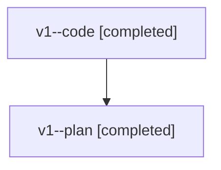

# Family: v1

[Agent Hoods](../README.md) / [bbugyi200](../users/bbugyi200/README.md) / [athena](../users/bbugyi200/machines/athena/README.md) / [v1](../users/bbugyi200/machines/athena/hoods/v1/README.md) / v1

Owner: `bbugyi200.athena` · Hood: `v1` · Members: 2

## Lineage

The diagram is an optional enhancement; the ordered table below contains the same lineage in accessible text.

| Role | Agent | State | Model / provider | Timing | Commits | Prompt | Chat |
|---|---|---|---|---|---:|---|---|
| code | v1--code | completed | sonnet / claude | 2026-08-07T20:53:21.822716+00:00 | [1](../agents/bbugyi200.athena.v1--code/README.md#commits) | — | [Chat](../agents/bbugyi200.athena.v1--code/chat.md) |
| plan | v1--plan | completed | opus / claude | 2026-08-07T20:13:18.782111+00:00 | 0 | [Prompt](../agents/bbugyi200.athena.v1--plan/prompt.md) | [Chat](../agents/bbugyi200.athena.v1--plan/chat.md) |

## Commits

| Role | Repo | Commit | Subject | Committed |
|---|---|---|---|---|
| code | sase | [`5a039ef`](https://github.com/sase-org/sase/commit/5a039ef149805f3d5bde7465b9c23c0050dc8bc9) | fix(deps): fail loudly when the built sase\_core\_rs is behind the pyproject floor | 2026-08-07 17:24:16 EDT |

## Neighbors

| Agent | Relation | State |
|---|---|---|
| [v1.f0](../agents/bbugyi200.athena.v1.f0/README.md) | descendant | dismissed |
| [v1.f1](../agents/bbugyi200.athena.v1.f1/README.md) | descendant | active |
