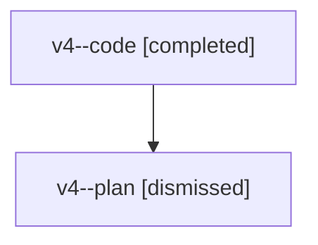

# Family: v4

[Agent Hoods](../README.md) / [bbugyi200](../users/bbugyi200/README.md) / [athena](../users/bbugyi200/machines/athena/README.md) / [v4](../users/bbugyi200/machines/athena/hoods/v4/README.md) / v4

Owner: `bbugyi200.athena` · Hood: `v4` · Members: 2

## Lineage

The diagram is an optional enhancement; the ordered table below contains the same lineage in accessible text.

| Role | Agent | State | Model / provider | Timing | Commits | Prompt | Chat |
|---|---|---|---|---|---:|---|---|
| code | v4--code | completed | sonnet / claude | 2026-08-07T21:21:26.932090+00:00 | [1](../agents/bbugyi200.athena.v4--code/README.md#commits) | — | [Chat](../agents/bbugyi200.athena.v4--code/chat.md) |
| plan | v4--plan | dismissed | opus / claude | 2026-08-07T17:09:04.596316 → 2026-08-07T17:38:00.840918 | 0 | — | [Chat](../agents/bbugyi200.athena.v4--plan/chat.md) |

## Commits

| Role | Repo | Commit | Subject | Committed |
|---|---|---|---|---|
| code | sase | [`aaa8245`](https://github.com/sase-org/sase/commit/aaa8245df375ee96f68bbeef62c0e1d60c3e2735) | fix(notification-gates): guard streaming stdin close against broken pipe | 2026-08-07 21:34:38 UTC |
