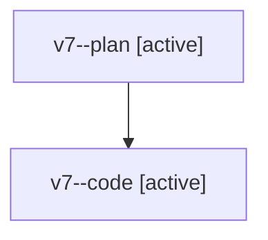

# Family: v7

[Agent Hoods](../README.md) / [bbugyi200](../users/bbugyi200/README.md) / [athena](../users/bbugyi200/machines/athena/README.md) / [v7](../users/bbugyi200/machines/athena/hoods/v7/README.md) / v7

Owner: `bbugyi200.athena` · Hood: `v7` · Members: 2

## Lineage

The diagram is an optional enhancement; the ordered table below contains the same lineage in accessible text.

| Role | Agent | State | Model / provider | Timing | Commits | Prompt | Chat |
|---|---|---|---|---|---:|---|---|
| plan | v7--plan | active | opus / claude | 2026-08-07T23:04:52.090248+00:00 | 0 | [Prompt](../agents/bbugyi200.athena.v7--plan/prompt.md) | [Chat](../agents/bbugyi200.athena.v7--plan/chat.md) |
| code | v7--code | active | sonnet / claude | 2026-08-07T23:14:30.971141+00:00 | 0 | — | — |

## Neighbors

| Agent | Relation | State |
|---|---|---|
| [v7.f0](../agents/bbugyi200.athena.v7.f0/README.md) | descendant | dismissed |
| [v7.f1](../agents/bbugyi200.athena.v7.f1/README.md) | descendant | dismissed |
