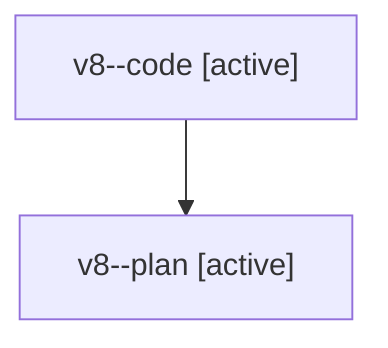

# Family: v8

[Agent Hoods](../README.md) / [bbugyi200](../users/bbugyi200/README.md) / [athena](../users/bbugyi200/machines/athena/README.md) / [v8](../users/bbugyi200/machines/athena/hoods/v8/README.md) / v8

Owner: `bbugyi200.athena` · Hood: `v8` · Members: 2

## Lineage

The diagram is an optional enhancement; the ordered table below contains the same lineage in accessible text.

| Role | Agent | State | Model / provider | Timing | Commits | Prompt | Chat |
|---|---|---|---|---|---:|---|---|
| code | v8--code | active | sonnet / claude | 2026-08-07T23:21:30.877426+00:00 | 0 | — | — |
| plan | v8--plan | active | opus / claude | 2026-08-07T23:09:04.082645+00:00 | 0 | [Prompt](../agents/bbugyi200.athena.v8--plan/prompt.md) | [Chat](../agents/bbugyi200.athena.v8--plan/chat.md) |
