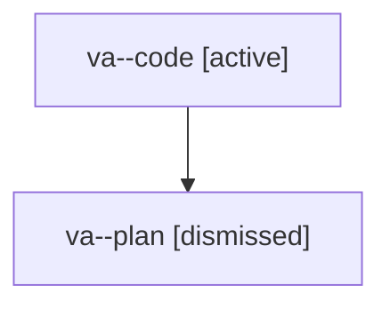

# Family: va

[Agent Hoods](../README.md) / [bbugyi200](../users/bbugyi200/README.md) / [athena](../users/bbugyi200/machines/athena/README.md) / [va](../users/bbugyi200/machines/athena/hoods/va/README.md) / va

Owner: `bbugyi200.athena` · Hood: `va` · Members: 2

## Lineage

The diagram is an optional enhancement; the ordered table below contains the same lineage in accessible text.

| Role | Agent | State | Model / provider | Timing | Commits | Prompt | Chat |
|---|---|---|---|---|---:|---|---|
| code | va--code | active | sonnet / claude | 2026-08-08T00:16:53.003590+00:00 | 0 | — | — |
| plan | va--plan | dismissed | opus / claude | 2026-08-07T20:07:57.999518 → 2026-08-07T20:24:14.453302 | 0 | — | — |
