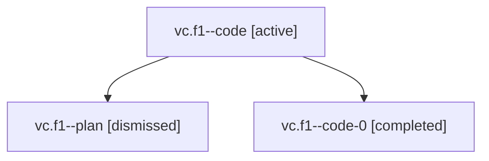

# Family: vc.f1

[Agent Hoods](../README.md) / [bbugyi200](../users/bbugyi200/README.md) / [athena](../users/bbugyi200/machines/athena/README.md) / [vc](../users/bbugyi200/machines/athena/hoods/vc/README.md) / vc.f1

Owner: `bbugyi200.athena` · Hood: `vc` · Members: 3

## Lineage

The diagram is an optional enhancement; the ordered table below contains the same lineage in accessible text.

| Role | Agent | State | Model / provider | Timing | Commits | Prompt | Chat |
|---|---|---|---|---|---:|---|---|
| code | vc.f1--code | active | sonnet / claude | 2026-08-08T01:52:07.916919+00:00 | 0 | — | [Chat](../agents/bbugyi200.athena.vc.f1--code/chat.md) |
| plan | vc.f1--plan | dismissed | opus / claude | 2026-08-07T21:45:55.977730 → 2026-08-07T21:55:56.212041 | 0 | — | [Chat](../agents/bbugyi200.athena.vc.f1--plan/chat.md) |
| code-0 | vc.f1--code-0 | completed | sonnet / claude | 2026-08-08T01:54:12.939582+00:00 | 0 | — | [Chat](../agents/bbugyi200.athena.vc.f1--code-0/chat.md) |

## Neighbors

| Agent | Relation | State |
|---|---|---|
| [vc](../agents/bbugyi200.athena.vc/README.md) | ancestor | dismissed |
| [vc.f0](../agents/bbugyi200.athena.vc.f0/README.md) | vc hood | dismissed |
