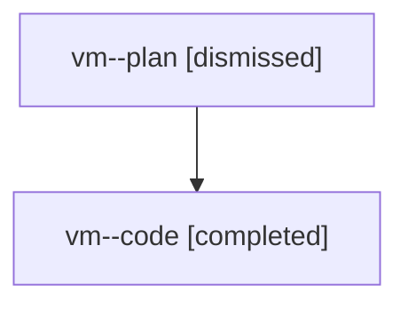

# Family: vm

[Agent Hoods](../README.md) / [bbugyi200](../users/bbugyi200/README.md) / [athena](../users/bbugyi200/machines/athena/README.md) / [vm](../users/bbugyi200/machines/athena/hoods/vm/README.md) / vm

Owner: `bbugyi200.athena` · Hood: `vm` · Members: 2

## Lineage

The diagram is an optional enhancement; the ordered table below contains the same lineage in accessible text.

| Role | Agent | State | Model / provider | Timing | Commits | Prompt | Chat |
|---|---|---|---|---|---:|---|---|
| plan | vm--plan | dismissed | opus / claude | 2026-08-07T23:18:09.683715 → 2026-08-07T23:51:50.153336 | 0 | — | [Chat](../agents/bbugyi200.athena.vm--plan/chat.md) |
| code | vm--code | completed | sonnet / claude | 2026-08-08T03:27:59.250550+00:00 | [1](../agents/bbugyi200.athena.vm--code/README.md#commits) | — | [Chat](../agents/bbugyi200.athena.vm--code/chat.md) |

## Commits

| Role | Repo | Commit | Subject | Committed |
|---|---|---|---|---|
| code | sase | [`315a5f9`](https://github.com/sase-org/sase/commit/315a5f9ffbb4ee110c5ca5b6d0ae5a6f6c45f54a) | fix(bead): fail cleanly on SDD materialization refusal in read commands | 2026-08-07 23:49:24 EDT |
