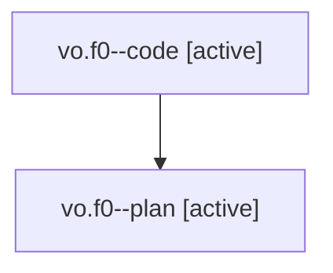

# Family: vo.f0

[Agent Hoods](../README.md) / [bbugyi200](../users/bbugyi200/README.md) / [athena](../users/bbugyi200/machines/athena/README.md) / [vo](../users/bbugyi200/machines/athena/hoods/vo/README.md) / vo.f0

Owner: `bbugyi200.athena` · Hood: `vo` · Members: 2

## Lineage

The diagram is an optional enhancement; the ordered table below contains the same lineage in accessible text.

| Role | Agent | State | Model / provider | Timing | Commits | Prompt | Chat |
|---|---|---|---|---|---:|---|---|
| code | vo.f0--code | active | gpt-5.5 / codex | 2026-08-08T15:36:58.515589+00:00 | 0 | — | — |
| plan | vo.f0--plan | active | gpt-5.6-sol / codex | 2026-08-08T15:25:58.185253+00:00 | 0 | [Prompt](../agents/bbugyi200.athena.vo.f0--plan/prompt.md) | [Chat](../agents/bbugyi200.athena.vo.f0--plan/chat.md) |

## Neighbors

| Agent | Relation | State |
|---|---|---|
| [vo](bbugyi200.athena.vo.md) (family · 2) | ancestor | completed 2 |
