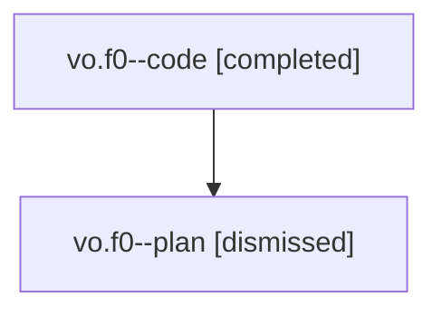

# Family: vo.f0

[Agent Hoods](../README.md) / [bbugyi200](../users/bbugyi200/README.md) / [athena](../users/bbugyi200/machines/athena/README.md) / [vo](../users/bbugyi200/machines/athena/hoods/vo/README.md) / vo.f0

Owner: `bbugyi200.athena` · Hood: `vo` · Members: 2

## Lineage

The diagram is an optional enhancement; the ordered table below contains the same lineage in accessible text.

| Role | Agent | State | Model / provider | Timing | Commits | Prompt | Chat |
|---|---|---|---|---|---:|---|---|
| code | vo.f0--code | completed | gpt-5.5 / codex | 2026-08-08T15:36:58.515589+00:00 | [1](../agents/bbugyi200.athena.vo.f0--code/README.md#commits) | — | [Chat](../agents/bbugyi200.athena.vo.f0--code/chat.md) |
| plan | vo.f0--plan | dismissed | gpt-5.6-sol / codex | 2026-08-08T11:25:58.185253 → 2026-08-08T11:59:50.440808 | 0 | — | [Chat](../agents/bbugyi200.athena.vo.f0--plan/chat.md) |

## Commits

| Role | Repo | Commit | Subject | Committed |
|---|---|---|---|---|
| code | sase | [`f4dfc26`](https://github.com/sase-org/sase/commit/f4dfc2626ba425bb9b24e55f65518a317ed172e4) | feat(beads): simplify snooze gate duration input | 2026-08-08 11:54:01 EDT |

## Neighbors

| Agent | Relation | State |
|---|---|---|
| [vo](bbugyi200.athena.vo.md) (family · 2) | ancestor | completed 1, dismissed 1 |
| [vo.f0.f0](../agents/bbugyi200.athena.vo.f0.f0/README.md) | descendant | dismissed |
