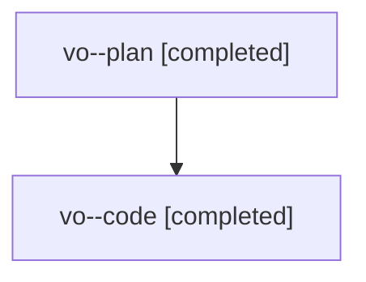

# Family: vo

[Agent Hoods](../README.md) / [bbugyi200](../users/bbugyi200/README.md) / [athena](../users/bbugyi200/machines/athena/README.md) / [vo](../users/bbugyi200/machines/athena/hoods/vo/README.md) / vo

Owner: `bbugyi200.athena` · Hood: `vo` · Members: 2

## Lineage

The diagram is an optional enhancement; the ordered table below contains the same lineage in accessible text.

| Role | Agent | State | Model / provider | Timing | Commits | Prompt | Chat |
|---|---|---|---|---|---:|---|---|
| plan | vo--plan | completed | gpt-5.6-sol / codex | 2026-08-08T14:06:12.184036+00:00 | 0 | [Prompt](../agents/bbugyi200.athena.vo--plan/prompt.md) | [Chat](../agents/bbugyi200.athena.vo--plan/chat.md) |
| code | vo--code | completed | gpt-5.5 / codex | 2026-08-08T14:17:59.071439+00:00 | [1](../agents/bbugyi200.athena.vo--code/README.md#commits) | — | [Chat](../agents/bbugyi200.athena.vo--code/chat.md) |

## Commits

| Role | Repo | Commit | Subject | Committed |
|---|---|---|---|---|
| code | sase | [`010b01a`](https://github.com/sase-org/sase/commit/010b01a4143e7e5fac5fb2efe26182245c86cc0c) | fix: focus invalid gate inputs before warning | 2026-08-08 10:41:24 EDT |

## Neighbors

| Agent | Relation | State |
|---|---|---|
| [vo.f0](bbugyi200.athena.vo.f0.md) (family · 2) | descendant | active 2 |
