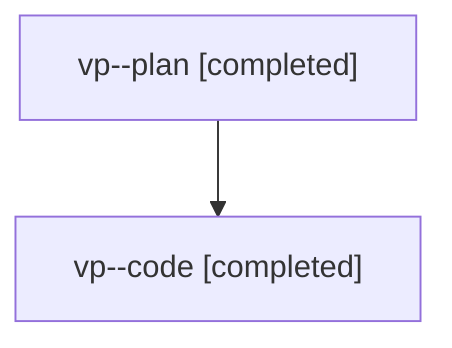

# Family: vp

[Agent Hoods](../README.md) / [bbugyi200](../users/bbugyi200/README.md) / [athena](../users/bbugyi200/machines/athena/README.md) / [vp](../users/bbugyi200/machines/athena/hoods/vp/README.md) / vp

Owner: `bbugyi200.athena` · Hood: `vp` · Members: 2

## Lineage

The diagram is an optional enhancement; the ordered table below contains the same lineage in accessible text.

| Role | Agent | State | Model / provider | Timing | Commits | Prompt | Chat |
|---|---|---|---|---|---:|---|---|
| plan | vp--plan | completed | gpt-5.6-sol / codex | 2026-08-08T15:06:08.438540+00:00 | 0 | [Prompt](../agents/bbugyi200.athena.vp--plan/prompt.md) | [Chat](../agents/bbugyi200.athena.vp--plan/chat.md) |
| code | vp--code | completed | gpt-5.5 / codex | 2026-08-08T15:15:33.116833+00:00 | [1](../agents/bbugyi200.athena.vp--code/README.md#commits) | — | [Chat](../agents/bbugyi200.athena.vp--code/chat.md) |

## Commits

| Role | Repo | Commit | Subject | Committed |
|---|---|---|---|---|
| code | sase | [`e802815`](https://github.com/sase-org/sase/commit/e8028151ef32819e637fe4062400c0387383a038) | feat: show selected snooze countdown in notifications | 2026-08-08 11:41:20 EDT |
