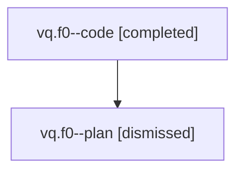

# Family: vq.f0

[Agent Hoods](../README.md) / [bbugyi200](../users/bbugyi200/README.md) / [athena](../users/bbugyi200/machines/athena/README.md) / [vq](../users/bbugyi200/machines/athena/hoods/vq/README.md) / vq.f0

Owner: `bbugyi200.athena` · Hood: `vq` · Members: 2

## Lineage

The diagram is an optional enhancement; the ordered table below contains the same lineage in accessible text.

| Role | Agent | State | Model / provider | Timing | Commits | Prompt | Chat |
|---|---|---|---|---|---:|---|---|
| code | vq.f0--code | completed | gpt-5.5 / codex | 2026-08-08T16:36:23.878771+00:00 | 0 | — | [Chat](../agents/bbugyi200.athena.vq.f0--code/chat.md) |
| plan | vq.f0--plan | dismissed | gpt-5.6-sol / codex | 2026-08-08T12:27:38.060267 → 2026-08-08T12:54:08.465681 | 0 | — | [Chat](../agents/bbugyi200.athena.vq.f0--plan/chat.md) |

## Neighbors

| Agent | Relation | State |
|---|---|---|
| [vq](bbugyi200.athena.vq.md) (family · 2) | ancestor | completed 1, dismissed 1 |
| [vq.f1](bbugyi200.athena.vq.f1.md) (family · 2) | vq hood | completed 1, dismissed 1 |
