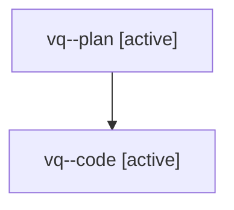

# Family: vq

[Agent Hoods](../README.md) / [bbugyi200](../users/bbugyi200/README.md) / [athena](../users/bbugyi200/machines/athena/README.md) / [vq](../users/bbugyi200/machines/athena/hoods/vq/README.md) / vq

Owner: `bbugyi200.athena` · Hood: `vq` · Members: 2

## Lineage

The diagram is an optional enhancement; the ordered table below contains the same lineage in accessible text.

| Role | Agent | State | Model / provider | Timing | Commits | Prompt | Chat |
|---|---|---|---|---|---:|---|---|
| plan | vq--plan | active | gpt-5.6-sol / codex | 2026-08-08T15:14:09.112436+00:00 | 0 | [Prompt](../agents/bbugyi200.athena.vq--plan/prompt.md) | [Chat](../agents/bbugyi200.athena.vq--plan/chat.md) |
| code | vq--code | active | gpt-5.5 / codex | 2026-08-08T15:22:46.697439+00:00 | 0 | — | — |

## Neighbors

| Agent | Relation | State |
|---|---|---|
| [vq.f0](../agents/bbugyi200.athena.vq.f0/README.md) | descendant | waiting |
