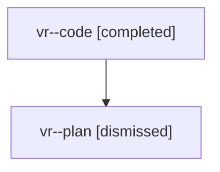

# Family: vr

[Agent Hoods](../README.md) / [bbugyi200](../users/bbugyi200/README.md) / [athena](../users/bbugyi200/machines/athena/README.md) / [vr](../users/bbugyi200/machines/athena/hoods/vr/README.md) / vr

Owner: `bbugyi200.athena` · Hood: `vr` · Members: 2

## Lineage

The diagram is an optional enhancement; the ordered table below contains the same lineage in accessible text.

| Role | Agent | State | Model / provider | Timing | Commits | Prompt | Chat |
|---|---|---|---|---|---:|---|---|
| code | vr--code | completed | gpt-5.5 / codex | 2026-08-08T15:37:08.183175+00:00 | [1](../agents/bbugyi200.athena.vr--code/README.md#commits) | — | [Chat](../agents/bbugyi200.athena.vr--code/chat.md) |
| plan | vr--plan | dismissed | gpt-5.6-sol / codex | 2026-08-08T11:27:54.502246 → 2026-08-08T12:26:28.535626 | 0 | — | [Chat](../agents/bbugyi200.athena.vr--plan/chat.md) |

## Commits

| Role | Repo | Commit | Subject | Committed |
|---|---|---|---|---|
| code | sase | [`125b5c3`](https://github.com/sase-org/sase/commit/125b5c31b23a147d1e65445a7c8a1ff862b4f543) | docs: document Muse Code provider support | 2026-08-08 12:21:49 EDT |
