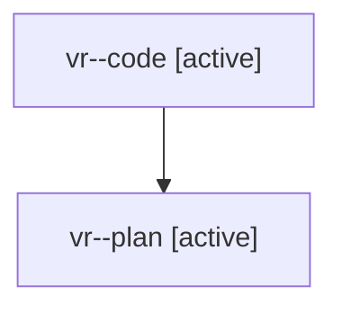

# Family: vr

[Agent Hoods](../README.md) / [bbugyi200](../users/bbugyi200/README.md) / [athena](../users/bbugyi200/machines/athena/README.md) / [vr](../users/bbugyi200/machines/athena/hoods/vr/README.md) / vr

Owner: `bbugyi200.athena` · Hood: `vr` · Members: 2

## Lineage

The diagram is an optional enhancement; the ordered table below contains the same lineage in accessible text.

| Role | Agent | State | Model / provider | Timing | Commits | Prompt | Chat |
|---|---|---|---|---|---:|---|---|
| code | vr--code | active | gpt-5.5 / codex | 2026-08-08T15:37:08.183175+00:00 | 0 | — | — |
| plan | vr--plan | active | gpt-5.6-sol / codex | 2026-08-08T15:27:54.502246+00:00 | 0 | [Prompt](../agents/bbugyi200.athena.vr--plan/prompt.md) | [Chat](../agents/bbugyi200.athena.vr--plan/chat.md) |
