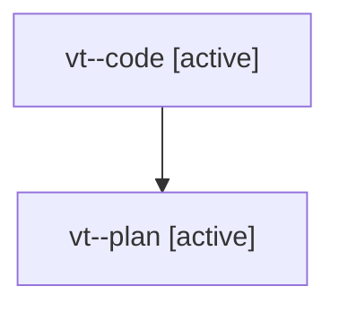

# Family: vt

[Agent Hoods](../README.md) / [bbugyi200](../users/bbugyi200/README.md) / [athena](../users/bbugyi200/machines/athena/README.md) / [vt](../users/bbugyi200/machines/athena/hoods/vt/README.md) / vt

Owner: `bbugyi200.athena` · Hood: `vt` · Members: 2

## Lineage

The diagram is an optional enhancement; the ordered table below contains the same lineage in accessible text.

| Role | Agent | State | Model / provider | Timing | Commits | Prompt | Chat |
|---|---|---|---|---|---:|---|---|
| code | vt--code | active | gpt-5.5 / codex | 2026-08-08T16:39:47.790082+00:00 | 0 | — | — |
| plan | vt--plan | active | gpt-5.6-sol / codex | 2026-08-08T16:22:19.324712+00:00 | 0 | [Prompt](../agents/bbugyi200.athena.vt--plan/prompt.md) | [Chat](../agents/bbugyi200.athena.vt--plan/chat.md) |
