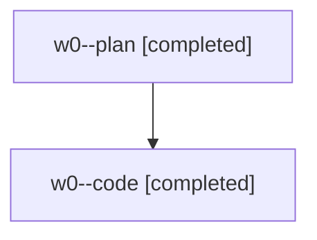

# Family: w0

[Agent Hoods](../README.md) / [bbugyi200](../users/bbugyi200/README.md) / [athena](../users/bbugyi200/machines/athena/README.md) / [w0](../users/bbugyi200/machines/athena/hoods/w0/README.md) / w0

Owner: `bbugyi200.athena` · Hood: `w0` · Members: 2

## Lineage

The diagram is an optional enhancement; the ordered table below contains the same lineage in accessible text.

| Role | Agent | State | Model / provider | Timing | Commits | Prompt | Chat |
|---|---|---|---|---|---:|---|---|
| plan | w0--plan | completed | gpt-5.6-sol / codex | 2026-08-08T19:44:39.092156+00:00 | 0 | [Prompt](../agents/bbugyi200.athena.w0--plan/prompt.md) | [Chat](../agents/bbugyi200.athena.w0--plan/chat.md) |
| code | w0--code | completed | gpt-5.5 / codex | 2026-08-08T19:48:47.584535+00:00 | [1](../agents/bbugyi200.athena.w0--code/README.md#commits) | — | [Chat](../agents/bbugyi200.athena.w0--code/chat.md) |

## Commits

| Role | Repo | Commit | Subject | Committed |
|---|---|---|---|---|
| code | sase | [`a06f12d`](https://github.com/sase-org/sase/commit/a06f12df8349c21e554026d5934c2440d8ca0962) | feat(bead): support multi-target work dispatch | 2026-08-08 16:38:57 EDT |
