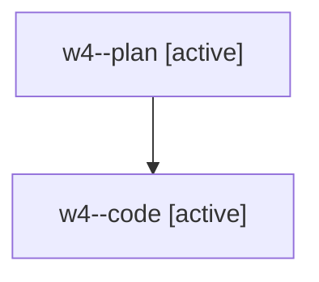

# Family: w4

[Agent Hoods](../README.md) / [bbugyi200](../users/bbugyi200/README.md) / [athena](../users/bbugyi200/machines/athena/README.md) / [w4](../users/bbugyi200/machines/athena/hoods/w4/README.md) / w4

Owner: `bbugyi200.athena` · Hood: `w4` · Members: 2

## Lineage

The diagram is an optional enhancement; the ordered table below contains the same lineage in accessible text.

| Role | Agent | State | Model / provider | Timing | Commits | Prompt | Chat |
|---|---|---|---|---|---:|---|---|
| plan | w4--plan | active | gpt-5.6-sol / codex | 2026-08-08T21:08:47.154334+00:00 | 0 | [Prompt](../agents/bbugyi200.athena.w4--plan/prompt.md) | [Chat](../agents/bbugyi200.athena.w4--plan/chat.md) |
| code | w4--code | active | gpt-5.5 / codex | 2026-08-08T21:15:48.413698+00:00 | [1](../agents/bbugyi200.athena.w4--code/README.md#commits) | — | — |

## Commits

| Role | Repo | Commit | Subject | Committed |
|---|---|---|---|---|
| code | sase | [`996f76d`](https://github.com/sase-org/sase/commit/996f76d32da9dd7aa52e2fa23f4403a887b0025e) | fix(xprompt): restore write target export | 2026-08-08 18:19:02 EDT |
