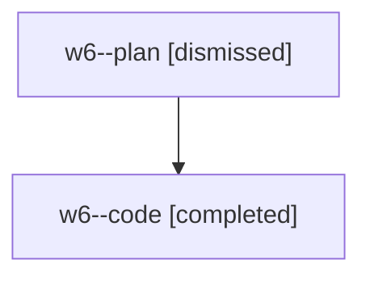

# Family: w6

[Agent Hoods](../README.md) / [bbugyi200](../users/bbugyi200/README.md) / [athena](../users/bbugyi200/machines/athena/README.md) / [w6](../users/bbugyi200/machines/athena/hoods/w6/README.md) / w6

Owner: `bbugyi200.athena` · Hood: `w6` · Members: 2

## Lineage

The diagram is an optional enhancement; the ordered table below contains the same lineage in accessible text.

| Role | Agent | State | Model / provider | Timing | Commits | Prompt | Chat |
|---|---|---|---|---|---:|---|---|
| plan | w6--plan | dismissed | gpt-5.6-sol / codex | 2026-08-08T18:52:50.676791 → 2026-08-08T19:45:17.160839 | 0 | — | [Chat](../agents/bbugyi200.athena.w6--plan/chat.md) |
| code | w6--code | completed | gpt-5.5 / codex | 2026-08-08T23:05:02.999180+00:00 | [1](../agents/bbugyi200.athena.w6--code/README.md#commits) | — | [Chat](../agents/bbugyi200.athena.w6--code/chat.md) |

## Commits

| Role | Repo | Commit | Subject | Committed |
|---|---|---|---|---|
| code | sase | [`9c06b4f`](https://github.com/sase-org/sase/commit/9c06b4f7028ac8a9c1fbd7bc8ca9eb530f4bc0b2) | fix: retain bead assignee for forced agent reuse | 2026-08-08 19:43:43 EDT |
