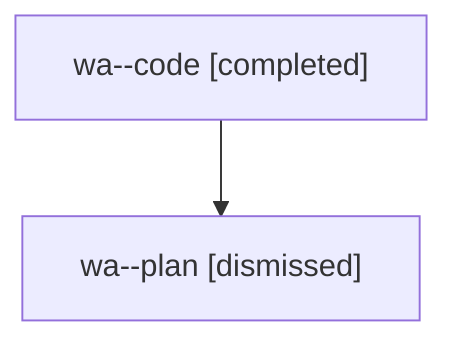

# Family: wa

[Agent Hoods](../README.md) / [bbugyi200](../users/bbugyi200/README.md) / [athena](../users/bbugyi200/machines/athena/README.md) / [wa](../users/bbugyi200/machines/athena/hoods/wa/README.md) / wa

Owner: `bbugyi200.athena` · Hood: `wa` · Members: 2

## Lineage

The diagram is an optional enhancement; the ordered table below contains the same lineage in accessible text.

| Role | Agent | State | Model / provider | Timing | Commits | Prompt | Chat |
|---|---|---|---|---|---:|---|---|
| code | wa--code | completed | gpt-5.5 / codex | 2026-08-09T11:39:25.500815+00:00 | [1](../agents/bbugyi200.athena.wa--code/README.md#commits) | — | [Chat](../agents/bbugyi200.athena.wa--code/chat.md) |
| plan | wa--plan | dismissed | opus / claude | 2026-08-09T07:33:45.766934 → 2026-08-09T07:51:25.706012 | 0 | — | [Chat](../agents/bbugyi200.athena.wa--plan/chat.md) |

## Commits

| Role | Repo | Commit | Subject | Committed |
|---|---|---|---|---|
| code | sase | [`9591b4e`](https://github.com/sase-org/sase/commit/9591b4e378cf2107b78784a77b006d838a86a36e) | fix: render glossary alias labels uppercase | 2026-08-09 07:47:49 EDT |

## Neighbors

| Agent | Relation | State |
|---|---|---|
| [wa.f0](../agents/bbugyi200.athena.wa.f0/README.md) | descendant | dismissed |
