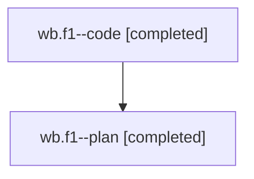

# Family: wb.f1

[Agent Hoods](../README.md) / [bbugyi200](../users/bbugyi200/README.md) / [athena](../users/bbugyi200/machines/athena/README.md) / [wb](../users/bbugyi200/machines/athena/hoods/wb/README.md) / wb.f1

Owner: `bbugyi200.athena` · Hood: `wb` · Members: 2

## Lineage

The diagram is an optional enhancement; the ordered table below contains the same lineage in accessible text.

| Role | Agent | State | Model / provider | Timing | Commits | Prompt | Chat |
|---|---|---|---|---|---:|---|---|
| code | wb.f1--code | completed | gpt-5.5 / codex | 2026-08-09T13:11:22.190876+00:00 | [1](../agents/bbugyi200.athena.wb.f1--code/README.md#commits) | — | [Chat](../agents/bbugyi200.athena.wb.f1--code/chat.md) |
| plan | wb.f1--plan | completed | gpt-5.6-sol / codex | 2026-08-09T13:08:40.891262+00:00 | 0 | [Prompt](../agents/bbugyi200.athena.wb.f1--plan/prompt.md) | [Chat](../agents/bbugyi200.athena.wb.f1--plan/chat.md) |

## Commits

| Role | Repo | Commit | Subject | Committed |
|---|---|---|---|---|
| code | sase | [`a2ebe06`](https://github.com/sase-org/sase/commit/a2ebe065a927529da472f95b127e52959f0ed75a) | docs: refine new task duplicate search guidance | 2026-08-09 09:19:37 EDT |

## Neighbors

| Agent | Relation | State |
|---|---|---|
| [wb](bbugyi200.athena.wb.md) (family · 2) | ancestor | completed 2 |
