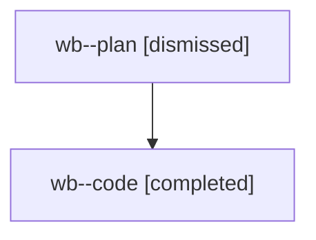

# Family: wb

[Agent Hoods](../README.md) / [bbugyi200](../users/bbugyi200/README.md) / [athena](../users/bbugyi200/machines/athena/README.md) / [wb](../users/bbugyi200/machines/athena/hoods/wb/README.md) / wb

Owner: `bbugyi200.athena` · Hood: `wb` · Members: 2

## Lineage

The diagram is an optional enhancement; the ordered table below contains the same lineage in accessible text.

| Role | Agent | State | Model / provider | Timing | Commits | Prompt | Chat |
|---|---|---|---|---|---:|---|---|
| plan | wb--plan | dismissed | opus / claude | 2026-08-09T07:35:53.888594 → 2026-08-09T07:57:41.612346 | 0 | — | [Chat](../agents/bbugyi200.athena.wb--plan/chat.md) |
| code | wb--code | completed | gpt-5.5 / codex | 2026-08-09T11:41:53.083469+00:00 | [1](../agents/bbugyi200.athena.wb--code/README.md#commits) | — | [Chat](../agents/bbugyi200.athena.wb--code/chat.md) |

## Commits

| Role | Repo | Commit | Subject | Committed |
|---|---|---|---|---|
| code | sase | [`fcc9be4`](https://github.com/sase-org/sase/commit/fcc9be44f2cf5ea8b5a23ab505d50f94a508f970) | fix: scope task duplicate detection to bead search | 2026-08-09 07:51:33 EDT |

## Neighbors

| Agent | Relation | State |
|---|---|---|
| [wb.f1](bbugyi200.athena.wb.f1.md) (family · 2) | descendant | completed 1, dismissed 1 |
