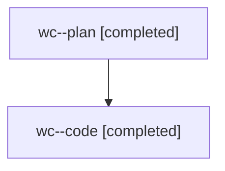

# Family: wc

[Agent Hoods](../README.md) / [bbugyi200](../users/bbugyi200/README.md) / [athena](../users/bbugyi200/machines/athena/README.md) / [wc](../users/bbugyi200/machines/athena/hoods/wc/README.md) / wc

Owner: `bbugyi200.athena` · Hood: `wc` · Members: 2

## Lineage

The diagram is an optional enhancement; the ordered table below contains the same lineage in accessible text.

| Role | Agent | State | Model / provider | Timing | Commits | Prompt | Chat |
|---|---|---|---|---|---:|---|---|
| plan | wc--plan | completed | opus / claude | 2026-08-09T11:39:15.092911+00:00 | 0 | [Prompt](../agents/bbugyi200.athena.wc--plan/prompt.md) | [Chat](../agents/bbugyi200.athena.wc--plan/chat.md) |
| code | wc--code | completed | gpt-5.5 / codex | 2026-08-09T11:51:39.812999+00:00 | [1](../agents/bbugyi200.athena.wc--code/README.md#commits) | — | [Chat](../agents/bbugyi200.athena.wc--code/chat.md) |

## Commits

| Role | Repo | Commit | Subject | Committed |
|---|---|---|---|---|
| code | sase | [`f35fa95`](https://github.com/sase-org/sase/commit/f35fa95482c481893dae821977430acfdeab8074) | fix(ace): align BY\_DATE buckets with terminal anchors | 2026-08-09 08:18:59 EDT |
