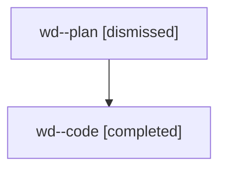

# Family: wd

[Agent Hoods](../README.md) / [bbugyi200](../users/bbugyi200/README.md) / [athena](../users/bbugyi200/machines/athena/README.md) / [wd](../users/bbugyi200/machines/athena/hoods/wd/README.md) / wd

Owner: `bbugyi200.athena` · Hood: `wd` · Members: 2

## Lineage

The diagram is an optional enhancement; the ordered table below contains the same lineage in accessible text.

| Role | Agent | State | Model / provider | Timing | Commits | Prompt | Chat |
|---|---|---|---|---|---:|---|---|
| plan | wd--plan | dismissed | opus / claude | 2026-08-09T07:47:34.832901 → 2026-08-09T08:20:44.600210 | 0 | — | [Chat](../agents/bbugyi200.athena.wd--plan/chat.md) |
| code | wd--code | completed | gpt-5.5 / codex | 2026-08-09T11:53:15.870813+00:00 | [1](../agents/bbugyi200.athena.wd--code/README.md#commits) | — | [Chat](../agents/bbugyi200.athena.wd--code/chat.md) |

## Commits

| Role | Repo | Commit | Subject | Committed |
|---|---|---|---|---|
| code | sase | [`7c7de9c`](https://github.com/sase-org/sase/commit/7c7de9c9feda339f38cb9d03512757bcb65a4b07) | fix(config): restore legacy changespec schema provider | 2026-08-09 12:19:58 UTC |
