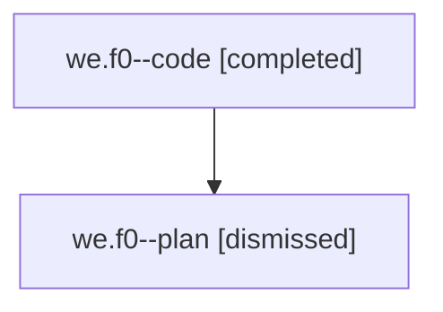

# Family: we.f0

[Agent Hoods](../README.md) / [bbugyi200](../users/bbugyi200/README.md) / [athena](../users/bbugyi200/machines/athena/README.md) / [we](../users/bbugyi200/machines/athena/hoods/we/README.md) / we.f0

Owner: `bbugyi200.athena` · Hood: `we` · Members: 2

## Lineage

The diagram is an optional enhancement; the ordered table below contains the same lineage in accessible text.

| Role | Agent | State | Model / provider | Timing | Commits | Prompt | Chat |
|---|---|---|---|---|---:|---|---|
| code | we.f0--code | completed | gpt-5.5 / codex | 2026-08-09T13:28:54.460500+00:00 | [1](../agents/bbugyi200.athena.we.f0--code/README.md#commits) | — | [Chat](../agents/bbugyi200.athena.we.f0--code/chat.md) |
| plan | we.f0--plan | dismissed | opus / claude | 2026-08-09T09:18:06.186012 → 2026-08-09T10:04:56.068121 | 0 | — | [Chat](../agents/bbugyi200.athena.we.f0--plan/chat.md) |

## Commits

| Role | Repo | Commit | Subject | Committed |
|---|---|---|---|---|
| code | sase | [`3ad2e62`](https://github.com/sase-org/sase/commit/3ad2e624cea555e1cfac75b7c31a0d0a4b2d3152) | feat(memory): number inlined short-memory subsections | 2026-08-09 14:00:11 UTC |

## Neighbors

| Agent | Relation | State |
|---|---|---|
| [we](../agents/bbugyi200.athena.we/README.md) | ancestor | dismissed |
| [we.f0.f0](../agents/bbugyi200.athena.we.f0.f0/README.md) | descendant | dismissed |
| [we.f0.w0](../agents/bbugyi200.athena.we.f0.w0/README.md) | descendant | dismissed |
| [we.f0.w1](../agents/bbugyi200.athena.we.f0.w1/README.md) | descendant | dismissed |
| [we.f0.w2](../agents/bbugyi200.athena.we.f0.w2/README.md) | descendant | dismissed |
