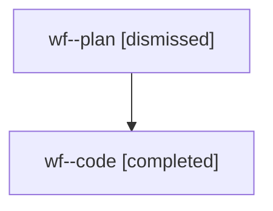

# Family: wf

[Agent Hoods](../README.md) / [bbugyi200](../users/bbugyi200/README.md) / [athena](../users/bbugyi200/machines/athena/README.md) / [wf](../users/bbugyi200/machines/athena/hoods/wf/README.md) / wf

Owner: `bbugyi200.athena` · Hood: `wf` · Members: 2

## Lineage

The diagram is an optional enhancement; the ordered table below contains the same lineage in accessible text.

| Role | Agent | State | Model / provider | Timing | Commits | Prompt | Chat |
|---|---|---|---|---|---:|---|---|
| plan | wf--plan | dismissed | opus / claude | 2026-08-09T08:56:06.507530 → 2026-08-09T09:29:22.064065 | 0 | — | [Chat](../agents/bbugyi200.athena.wf--plan/chat.md) |
| code | wf--code | completed | gpt-5.5 / codex | 2026-08-09T13:06:19.918476+00:00 | [1](../agents/bbugyi200.athena.wf--code/README.md#commits) | — | [Chat](../agents/bbugyi200.athena.wf--code/chat.md) |

## Commits

| Role | Repo | Commit | Subject | Committed |
|---|---|---|---|---|
| code | sase | [`e5487ce`](https://github.com/sase-org/sase/commit/e5487ce35812e88e758e7daa3638da25dd3b0fcd) | fix(tui): keep prompt glossary highlights stable while typing | 2026-08-09 09:27:19 EDT |
